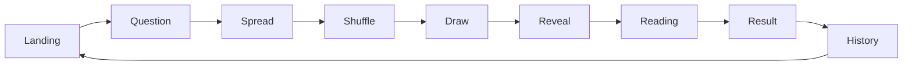

# AI Tarot PRD（产品需求文档）

> 版本：v1.0 · 状态：MVP 评审稿
> 作者：Product Manager
> 更新时间：2026-07-15
> 项目周期：1~2 周（Vibe Coding 模式）

---

## 1. 项目概述

### 1.1 项目名称
**AI Tarot** —— 一个具有沉浸式体验的 AI 塔罗占卜 Web 应用。

### 1.2 项目背景
随着 Z 世代对"玄学 + 心理疗愈 + AI"的关注度持续提升，塔罗占卜逐渐从线下神秘学场景，迁移为一种轻量级心理陪伴与情绪疏导工具。本项目以塔罗为载体，结合大语言模型（LLM）的语义理解与生成能力，为用户提供"提问 → 抽牌 → 解读 → 反思"的一站式占卜体验。

### 1.3 项目愿景
让每一次"抽牌"都成为一次**自我对话**：AI 不是算命先生，而是**启发者、陪伴者与思考的镜子**。

### 1.4 项目阶段
- **本阶段（MVP）**：1~2 周交付，聚焦核心占卜体验闭环。
- **下一阶段**：多牌阵、多模态、社交化。

### 1.5 核心关键词
- 神秘感（Mystic）
- 沉浸感（Immersive）
- 治愈（Healing）
- AI 陪伴（AI Companion）
- 仪式感（Ritual）

---

## 2. 产品定位

### 2.1 一句话定位
> 一款"像仪式，又像冥想"的 AI 塔罗占卜网站 —— 每次抽牌，都是一次与内心的对话。

### 2.2 产品形态
- **类型**：单页应用（SPA）+ 多页面路由（React Router）。
- **部署**：静态站点，托管于 GitHub Pages。
- **交互形态**：纯前端 + AI API + LocalStorage，无需后端服务。

### 2.3 差异化价值
| 维度 | 传统塔罗 App | 心理测试类 | **AI Tarot** |
| --- | --- | --- | --- |
| 仪式感 | 弱 | 无 | **强（动画 + 文案）** |
| 个性化 | 模板化 | 模板化 | **AI 动态生成** |
| 情绪价值 | 偏猎奇 | 偏娱乐 | **陪伴与治愈** |
| 进入门槛 | 高 | 低 | **极低（一句话提问）** |
| 数据沉淀 | 无 | 无 | **本地历史回顾** |

### 2.4 价值主张（User Value Statement）
> "把情绪与困惑交给牌，AI 把牌翻译成你听得懂的话。"

---

## 3. 项目目标

### 3.1 业务目标
1. 在 1~2 周内交付一个可体验、可演示、可部署的 MVP。
2. 验证"AI 塔罗 + 仪式化交互"是否能形成用户的复访与分享行为。
3. 沉淀塔罗领域 Prompt Engineering 与前端动效工程的最佳实践。

### 3.2 用户目标
- 用户能在 **3 分钟内** 完成一次完整的占卜体验。
- 用户能在解读中获得**情绪共鸣**与**可执行的思考方向**。
- 用户能随时回顾自己的"占卜日记"。

### 3.3 成功指标（MVP 阶段）
| 指标 | 目标值 | 说明 |
| --- | --- | --- |
| 完整流程完成率 | ≥ 70% | 进入首页到查看解读的用户比例 |
| 单次占卜平均时长 | ≥ 90s | 含动画与阅读 |
| 解读满意度 | ≥ 4.0/5.0 | 解读页内置"是否有帮助"反馈 |
| 7 日内复访率 | ≥ 25% | 通过 LocalStorage 事件统计 |
| 分享率 | ≥ 10% | 解读页"分享"按钮（可选） |

---

## 4. 用户画像

### 4.1 主要用户群

#### Persona A：小鹿（大学生）
- **年龄**：21 岁
- **身份**：大三大文科女生
- **场景**：期末考完、失恋、纠结是否考研
- **设备**：iPhone，碎片化时间
- **动机**：寻求情绪出口、低成本心理陪伴、"测一下玩玩"
- **痛点**：传统咨询贵且门槛高；塔罗 App 套路化；想要"被倾听"
- **期待**：像和一个懂自己的朋友聊天一样，得到温柔回应

#### Persona B：阿哲（年轻职场人）
- **年龄**：26 岁
- **身份**：互联网公司运营
- **场景**：年中迷茫、想跳槽、想确认自己选择是否正确
- **设备**：Mac / iPad，多在晚上使用
- **动机**：辅助决策、寻找"确认感"、解压
- **痛点**：AI 工具给建议太"工具感"；塔罗 App 不够深度
- **期待**：解读要"走心"，能引导自己思考，而不是直接给答案

#### Persona C：Mia（塔罗爱好者）
- **年龄**：28 岁
- **身份**：设计 + 玄学双修
- **场景**：日常抽一张"今日运势"、记录自己的状态
- **设备**：桌面 + 移动端
- **动机**：把塔罗融入生活仪式
- **痛点**：手动翻牌 + 翻书太麻烦
- **期待**：好看的卡面 + 流畅动效 + 可回看历史

### 4.2 用户使用场景
1. **情绪出口型**：心情低落、焦虑时，希望被温柔回应。
2. **决策辅助型**：面临选择，希望获得"另一个角度"的思考。
3. **日常仪式型**：每日或每周固定时间抽牌，作为自我反思的仪式。
4. **社交分享型**：抽到有意思的牌会想截图发朋友圈。

### 4.3 用户需求层次
1. **基础需求**：能抽牌、能看解读。
2. **进阶需求**：解读要个性化、要有美感。
3. **情感需求**：要被理解、被陪伴、被启发。
4. **社交需求**：可分享、可回看。

---

## 5. 用户痛点分析

| 痛点 | 描述 | 现有方案缺陷 | AI Tarot 解决思路 |
| --- | --- | --- | --- |
| **解读千篇一律** | 通用解读，不结合问题 | 模板化文案，缺个性 | LLM 基于"问题 + 牌 + 牌阵"动态生成 |
| **缺乏情绪共鸣** | 冷冰冰的"凶/吉"判断 | 无情绪设计 | 治愈系文案 + 温柔动效 + 寄语 |
| **占卜无沉淀** | 抽完即忘，无法回顾 | 无历史 | LocalStorage 自动保存每次记录 |
| **进入门槛高** | 需要懂牌阵、懂牌意 | 新手劝退 | 默认 3 牌阵，零基础可上手 |
| **仪式感缺失** | 像做问卷，不像仪式 | 弱动效 | 洗牌 → 抽牌 → 翻牌 → 解读全流程动效 |
| **隐私顾虑** | 心理问题不想被记录 | 注册、登录、上传 | 完全本地化，零账号 |

---

## 6. 产品价值（Value Proposition）

### 6.1 对用户
- **即时反馈**：3 分钟内获得一次完整的"提问 → 反思"体验。
- **情绪价值**：被倾听、被理解、被启发，而非"被算命"。
- **长期复利**：历史记录形成个人的"心路档案"。

### 6.2 对产品
- 极低运营成本：纯静态 + AI API。
- 高复访潜力：仪式化体验 + 历史沉淀。
- 易传播：解读结果天然具备"金句"属性。

### 6.3 对开发（学习价值）
- 完整的 Vibe Coding 实践：Prompt → AI 生成 → 调试 → 部署。
- 端到端 AI Web 产品：状态管理、动效、API、存储、部署。
- 可作为 AI + 前端结合的 Portfolio。

---

## 7. Design Principles（设计原则）

| 原则 | 描述 | 落地表现 |
| --- | --- | --- |
| **仪式优先** | 每一个页面都要"有进入感" | 转场动画、星空背景、字体选择 |
| **隐喻驱动** | 用塔罗的语言表达 UI | 牌背、蜡烛、墨水、符文等元素 |
| **温柔陪伴** | 文案不评判、不恐吓 | 解读避免"凶/吉"，使用"提示/方向" |
| **留白美学** | 不堆信息，让用户慢下来 | 大间距、单一焦点 |
| **即时反馈** | 任何操作都有视觉响应 | 按钮悬浮、卡牌浮动、解读打字机 |
| **可逆可退** | 用户随时可回到上一步 | 顶部"返回"按钮保留上下文 |
| **零账号** | 不打扰，不索取 | 默认匿名，数据本地化 |

---

## 8. 用户流程（User Flow）

### 8.1 核心流程（Happy Path）
```
[Landing] 
   ↓ 点击"开始占卜"
[Question] 输入问题
   ↓ 点击"下一步"
[Spread] 选择牌阵（默认 3 牌阵）
   ↓ 点击"开始洗牌"
[Shuffle] 洗牌动画（2~3s）
   ↓ 动画结束自动进入
[Draw] 抽牌交互（点击牌堆抽 N 张）
   ↓ 抽满后自动
[Reveal] 翻牌动画（每张牌 0.6s 依次翻开）
   ↓ 全部翻开
[Reading] AI 解读（loading + 打字机效果）
   ↓ 解读完成
[Result] 幸运色 / 幸运数字 / 一句话寄语
   ↓ 点击"保存到历史"
[History] 本地历史记录
```

### 8.2 流程图


### 8.3 异常流程
- 流程中刷新页面 → 弹出"是否恢复上次进度"提示（基于 LocalStorage 草稿）。
- API 调用失败 → 显示"星星信号微弱，请稍后重试"友好兜底文案。
- 用户未输入问题 → 按钮置灰 + 引导文案。

---

## 9. 信息架构（Information Architecture）

### 9.1 页面清单
| # | 页面 | 路由 | 说明 |
| --- | --- | --- | --- |
| 1 | Landing | `/` | 首页，价值主张 + CTA |
| 2 | Question | `/question` | 输入占卜问题 |
| 3 | Spread | `/spread` | 选择牌阵 |
| 4 | Shuffle | `/shuffle` | 洗牌动画 |
| 5 | Draw | `/draw` | 抽牌交互 |
| 6 | Reveal | `/reveal` | 翻牌动画 |
| 7 | Reading | `/reading` | AI 解读 |
| 8 | Result | `/result` | 幸运色/数字/寄语 |
| 9 | History | `/history` | 历史记录列表 |
| 10 | Detail | `/history/:id` | 单条历史详情 |

### 9.2 全局元素
- **顶部导航**：Logo、返回按钮（条件渲染）。
- **底部信息**：版权、GitHub 链接。
- **背景层**：星空 + 渐变 + 飘动粒子。
- **音乐（可选）**：环境白噪音开关。

---

## 10. 功能需求（按页面拆分）

> 每个功能模块包含：**目标 / 功能 / 交互 / 输入输出 / 异常处理**。

---

### 10.1 Landing（首页）

- **目标**：传达产品价值，引导用户开始占卜。
- **功能**：
  1. 品牌展示：Logo + 一句话 Slogan。
  2. 主 CTA："开始占卜"按钮。
  3. 副 CTA："查看历史"按钮（无历史时隐藏或置灰）。
  4. 背景动效：星空粒子缓慢漂浮。
  5. 文案：3~4 行治愈系介绍。
- **交互**：
  - 按钮悬浮：发光 / 缩放 / 阴影增强。
  - 页面进入：文字逐行淡入。
  - 点击主 CTA：路由跳转 `/question`，并播放"翻牌声"（可选）。
- **输入**：无。
- **输出**：导航事件。
- **异常**：
  - LocalStorage 不可用 → 不影响主流程，副 CTA 隐藏。

---

### 10.2 Question（问题输入页）

- **目标**：引导用户聚焦内心，写下当下最想问的问题。
- **功能**：
  1. 大尺寸文本框（`textarea`），placeholder 示例："我最近该不该换工作？"
  2. 字符计数：上限 100 字。
  3. "下一步"按钮，未输入时置灰。
  4. 引导文案：上方 1~2 句引导（如"把问题交给牌之前，先交给自己的心"）。
  5. 草稿自动保存：每 1s 写入 LocalStorage。
- **交互**：
  - 输入框 focus 时轻微放大 + 边框发光。
  - 字数接近上限时颜色变橙。
  - 离开页面提示未保存（使用 `beforeunload`，仅在有内容时）。
- **输入**：`question: string`（1~100 字符）。
- **输出**：写入全局状态 + LocalStorage 草稿。
- **异常**：
  - 全空格 / 纯符号 → 视为空，按钮置灰。
  - 超长输入 → 截断 100 字符。

---

### 10.3 Spread（牌阵选择页）

- **目标**：让用户选择解读的展开方式。
- **功能**：
  1. 展示可选牌阵卡片：
     - **Three Card**（默认）—— 过去 / 现在 / 未来。
     - **Celtic Cross**（预留，灰显 + "敬请期待"标签）。
  2. 每张卡片包含：牌阵图示、名称、简介、所需牌数。
  3. 选中态：高亮 + 边框发光。
  4. "开始洗牌"按钮。
- **交互**：
  - 鼠标悬浮牌阵卡片：轻微上浮。
  - 选中后按钮文字变为"以 Three Card 开始洗牌"。
- **输入**：`spreadType: 'three-card' | 'celtic-cross'`。
- **输出**：写入全局状态。
- **异常**：
  - Celtic Cross 不可点击（`disabled` + 提示）。

---

### 10.4 Shuffle（洗牌动画页）

- **目标**：营造仪式感，让用户"交出主动权"。
- **功能**：
  1. 视觉：中央展示完整 78 张牌（精简为缩略图），随机洗牌动画。
  2. 动效：
     - 牌组 3D 旋转 + 错位浮动。
     - 持续时间 2.5s。
     - 结束态：牌组收拢为 1 叠。
  3. 文案：动态切换"正在洗牌..."→"洗牌完成"→ 自动跳转 `/draw`。
  4. 跳过按钮：右上角小字"跳过动画"。
- **交互**：
  - 用户不可主动操作牌，仅可跳过。
  - 跳过 → 直接进入 Draw。
- **输入**：`spreadType`。
- **输出**：动画结束触发路由跳转。
- **异常**：
  - 用户刷新页面 → 重新进入洗牌流程。

---

### 10.5 Draw（抽牌页）

- **目标**：用户通过点击"主动抽取"属于自己的牌。
- **功能**：
  1. 中央展示一摞牌（牌背朝上）。
  2. 用户依次点击抽牌：
     - Three Card：抽 3 张。
     - 抽到第 N 张时，自动放置到对应位置（过去 / 现在 / 未来）。
  3. 每次抽牌：牌从牌堆飞出 + 落位动画。
  4. 抽满后自动进入 `/reveal`。
  5. 位置提示：每个位置显示标签（"过去 / 现在 / 未来"）。
- **交互**：
  - 牌堆悬浮发光：提示可点击。
  - 牌点击后轻微缩放并飞出。
  - 抽完前不可返回上一步（避免状态错乱）。
- **输入**：用户点击事件。
- **输出**：
  ```ts
  drawnCards: Array<{ position: 'past'|'present'|'future', cardId: string }>
  ```
- **异常**：
  - 用户快速连点：使用防抖 + 已抽位置不可重复抽。

---

### 10.6 Reveal（翻牌页）

- **目标**：揭晓牌面，制造"啊哈时刻"。
- **功能**：
  1. 已抽出的 3 张牌正面朝下并排展示。
  2. 用户可点击任意牌翻看，或点击"全部翻开"按钮。
  3. 翻牌动画：3D Y 轴 180° 翻转 0.6s。
  4. 全部翻开 → 2s 后自动跳转 `/reading`。
  5. 翻牌时显示牌名 + 关键词 + 简短牌意。
- **交互**：
  - 翻牌后牌轻微发光 + 浮起。
  - 自动翻：每张间隔 0.8s。
- **输入**：`drawnCards`。
- **输出**：触发 `/reading` 路由。
- **异常**：无。

---

### 10.7 Reading（AI 解读页）

- **目标**：AI 基于问题 + 牌 + 牌阵给出个性化解读。
- **功能**：
  1. 上半屏：展示已翻开的 3 张牌（可缩略图）。
  2. 中部：标题"AI 正在为你解读..."。
  3. 下半屏：解读内容以**打字机效果**逐字出现。
  4. 解读结构（详见 §13）：
     - 整体概述
     - 每张牌的含义（按位置）
     - 给你的建议
  5. 加载中：旋转的卡牌 / 星空粒子。
  6. 完成后显示"查看结果"按钮 → `/result`。
  7. 反馈按钮："这次解读有帮到我吗？👍 / 👎"。
- **交互**：
  - 打字机速度：30ms/字。
  - 加载超时（>30s）：提示重试。
  - 反馈点击后高亮 + Toast 提示"感谢你的反馈"。
- **输入**：
  ```ts
  { question, spreadType, drawnCards }
  ```
- **输出**：
  ```ts
  reading: { overview, perCard[], advice }
  ```
- **异常**：
  - API 失败 → "星星信号微弱，请稍后重试" + 重试按钮。
  - 返回内容为空 → 使用兜底文案。
  - 网络断开 → 检测 `navigator.onLine` 提示。

---

### 10.8 Result（结果页）

- **目标**：仪式感收尾 + 引发分享与保存。
- **功能**：
  1. 三大模块卡片：
     - **幸运色**：色块 + 颜色名。
     - **幸运数字**：大字号 + 含义。
     - **一句话寄语**：金句。
  2. "保存到历史"按钮（默认自动保存）。
  3. "再抽一次"按钮 → 回到 `/question`。
  4. "分享"按钮（Nice to Have）→ 调用 `navigator.share` 或复制到剪贴板。
- **交互**：
  - 卡片入场：依次淡入 + 轻微上浮。
  - 寄语打字机效果。
- **输入**：`reading` + `luckyItems`。
- **输出**：写入 LocalStorage 历史记录。
- **异常**：
  - 浏览器不支持分享 API → 降级为"复制链接/文字"。

---

### 10.9 History（历史记录列表页）

- **目标**：让用户回看自己的"占卜日记"。
- **功能**：
  1. 卡片列表：每条显示日期、问题前 20 字、牌阵、第一张牌。
  2. 按时间倒序。
  3. 顶部 Tab：全部 / 本周 / 本月。
  4. 搜索框（Nice to Have）：按问题关键词。
  5. 空状态：插画 + "还没有记录，去开始第一次占卜吧"。
  6. 单条操作：点击进入详情 / 长按删除（带确认）。
- **交互**：
  - 卡片悬浮：阴影增强。
  - 删除：滑出动画。
- **输入**：LocalStorage 读取。
- **输出**：导航至 `/history/:id`。
- **异常**：
  - 数据为空 → 空状态插画。
  - 解析失败 → 跳过该条 + 错误日志。

---

### 10.10 Detail（历史详情页）

- **目标**：完整复现一次占卜体验。
- **功能**：
  1. 顶部：日期 + 牌阵标签。
  2. 用户问题（突出展示）。
  3. 三张牌（含正逆位）。
  4. 完整 AI 解读。
  5. 幸运色 / 数字 / 寄语。
  6. 操作：删除 / 重新占卜。
- **交互**：
  - 滚动动效：进入视口渐入。
- **输入**：`historyId`。
- **输出**：删除 / 重新发起。
- **异常**：
  - ID 不存在 → 跳转回 `/history`。

---

## 11. 非功能需求

### 11.1 性能
| 指标 | 目标 |
| --- | --- |
| 首屏加载（FCP） | ≤ 2.0s（4G） |
| 页面切换（路由） | ≤ 300ms |
| 动画帧率 | 稳定 60fps |
| 资源体积 | 主 bundle ≤ 300KB（gzipped） |

### 11.2 响应式
- **断点**：
  - Mobile：< 768px（默认优化目标）
  - Tablet：768~1024px
  - Desktop：> 1024px
- **设计原则**：Mobile First。
- **布局适配**：
  - 牌阵：单列 → 多列。
  - 字号：clamp 自适应。

### 11.3 动画
- 库：CSS + Framer Motion（推荐）。
- 原则：
  - 入场 ≤ 600ms。
  - 缓动函数：`cubic-bezier(0.16, 1, 0.3, 1)`（easeOutExpo 系）。
  - 尊重 `prefers-reduced-motion`。
- 关键动效：
  - 洗牌：3D 旋转 + 浮动。
  - 翻牌：Y 轴翻转。
  - 解读：打字机。
  - 背景：粒子持续漂浮（Canvas 或 CSS）。

### 11.4 体验
- 加载：所有异步操作均有 loading 态。
- 错误：友好文案 + 重试入口。
- 反馈：操作有即时视觉响应。
- 可访问性：
  - 按钮可键盘聚焦。
  - 颜色对比度 ≥ 4.5:1。
  - 提供 `aria-label`。

### 11.5 浏览器兼容
- Chrome / Edge / Safari 最新两个大版本。
- 移动端 Safari iOS 14+。
- 不支持 IE。

### 11.6 安全 & 隐私
- 无登录、无后端存储。
- LocalStorage 数据用户可一键清空。
- AI API 调用需配置环境变量，Key 不暴露前端（建议通过简单 Vite Proxy / Serverless Function，MVP 阶段可前端直连 + 限流）。

---

## 12. 数据结构设计

### 12.1 全局状态（Zustand / Context）
```ts
interface SessionState {
  question: string;
  spreadType: 'three-card' | 'celtic-cross';
  drawnCards: DrawnCard[];
  reading: Reading | null;
  lucky: LuckyItems | null;
  setQuestion(q: string): void;
  setSpread(s: SpreadType): void;
  addDrawnCard(card: DrawnCard): void;
  setReading(r: Reading): void;
  setLucky(l: LuckyItems): void;
  reset(): void;
}
```

### 12.2 塔罗牌定义（专业版）

```ts
interface TarotCard {
  // ===== 基础标识 =====
  id: string;                      // "major-00", "wands-ace", "cups-queen"
  name: string;                    // "The Fool"
  nameZh: string;                  // "愚者"
  arcana: 'major' | 'minor';       // 大/小阿尔卡纳
  suit?: 'wands' | 'cups' | 'swords' | 'pentacles';  // 仅小阿尔卡纳
  rank?: 'ace' | '2' | '3' | '4' | '5' | '6' | '7' | '8' | '9' | '10'
        | 'page' | 'knight' | 'queen' | 'king';     // 仅小阿尔卡纳
  number: number;                  // 0~21（major）/ 1~14（minor，Ace=1, Page=11, Knight=12, Queen=13, King=14）

  // ===== 牌意 =====
  keywords: string[];              // 3~5 个关键词（正位）
  reversedKeywords: string[];      // 逆位关键词
  uprightMeaning: string;          // 正位含义（30~80 字）
  reversedMeaning: string;         // 逆位含义（30~80 字）
  uprightAdvice: string;           // 正位行动建议（20~40 字）
  reversedAdvice: string;          // 逆位行动建议（20~40 字）
  symbolism: string;               // 核心象征描述（图像/元素/原型）

  // ===== 专业对应 =====
  element?: 'fire' | 'water' | 'air' | 'earth';  // 元素（小阿尔卡纳按花色）
  zodiac?: string;                 // 对应星座（仅部分大阿尔卡纳）
  planet?: string;                // 对应行星（可选）
  numerology?: number;             // 卡巴拉数（0~21，大阿尔卡纳专属）
  hebrewLetter?: string;           // 希伯来字母（大阿尔卡纳）
  treeOfLifePath?: number;         // 生命之树路径 11~32

  // ===== 资源 =====
  imageUrl: string;                // 牌面图
  imageUrlReversed?: string;       // 逆位图（可选，多数情况 CSS rotate 即可）
}
```

> **设计取舍**：MVP 阶段 `hebrewLetter` / `treeOfLifePath` / `zodiac` 可设为可选字段，**仅在专业版**或后续版本强制要求。

### 12.3 抽牌记录
```ts
interface DrawnCard {
  position: 'past' | 'present' | 'future'; // 视牌阵扩展
  cardId: string;
  isReversed: boolean;   // 5% 概率逆位
}
```

### 12.4 解读返回
```ts
interface Reading {
  overview: string;          // 100~200 字
  perCard: Array<{
    position: string;
    cardName: string;
    interpretation: string;   // 60~120 字
  }>;
  advice: string;            // 60~100 字
}
```

### 12.5 幸运元素
```ts
interface LuckyItems {
  color: { name: string; hex: string; meaning: string };
  number: number;
  phrase: string;            // 一句话寄语
}
```

### 12.6 历史记录
```ts
interface HistoryRecord {
  id: string;                // uuid
  createdAt: number;         // timestamp
  question: string;
  spreadType: SpreadType;
  drawnCards: DrawnCard[];
  reading: Reading;
  lucky: LuckyItems;
}
```

### 12.7 LocalStorage Key 设计
| Key | 类型 | 说明 |
| --- | --- | --- |
| `ai-tarot:history` | `HistoryRecord[]` | 历史记录 |
| `ai-tarot:draft` | `{ question?: string; step?: string }` | 草稿 |
| `ai-tarot:settings` | `{ motion: boolean; sound: boolean }` | 用户偏好 |

---

## 13. AI 功能设计

### 13.1 模型与接口
- **模型**：OpenAI GPT-4o-mini / 通义千问 / DeepSeek（任选其一）。
- **接口**：`/v1/chat/completions`。
- **流式**：开启 `stream=true` 以支持打字机效果。

### 13.2 Prompt 输入结构

#### System Prompt
```
你是一位温柔、富有洞察力的塔罗解读师。你的任务是基于用户的问题、所抽到的牌以及牌阵结构，给出有温度、有启发性、不评判的解读。

原则：
1. 永远不要"预言"具体事件，避免绝对化表述。
2. 用"可能 / 倾向 / 建议"等柔软措辞。
3. 解读要结合用户的具体问题，不能套用通用模板。
4. 文风温柔治愈，鼓励用户自我反思。
5. 控制在指定字数内。
```

#### User Prompt 模板
```
【用户问题】
{question}

【牌阵】
{spreadType}：{positionDescription}

【抽到的牌】
- 位置 1（{position1}）：{card1}（{正/逆位}）
- 位置 2（{position2}）：{card2}（{正/逆位}）
- 位置 3（{position3}）：{card3}（{正/逆位}）

【输出要求】
请严格以 JSON 格式输出，结构如下：
{
  "overview": "（100~200 字整体概述）",
  "perCard": [
    { "position": "past", "interpretation": "（60~120 字）" },
    { "position": "present", "interpretation": "（60~120 字）" },
    { "position": "future", "interpretation": "（60~120 字）" }
  ],
  "advice": "（60~100 字给用户的建议）"
}
```

### 13.3 输出结构校验
- 必须为合法 JSON。
- 字段缺失 → 兜底文案。
- 字数超限 → 截断并拼接省略号。

### 13.4 异常处理
| 异常 | 表现 | 处理 |
| --- | --- | --- |
| API 限流 | 429 | 退避重试 2 次 |
| 超时 | 30s | 提示重试 |
| 返回非 JSON | 解析失败 | 提示 + 重试 |
| 内容含敏感词 | 审核拦截 | 兜底文案 |
| 网络断开 | offline | Toast 提示 |

### 13.5 兜底文案（Fallback）
```json
{
  "overview": "今天的牌阵似乎在提醒你：慢一点，听听自己的声音。",
  "perCard": [
    { "position": "past", "interpretation": "过去的经历正在为你累积智慧。" },
    { "position": "present", "interpretation": "当下你比自己以为的更有力量。" },
    { "position": "future", "interpretation": "未来还有多种可能，等你慢慢展开。" }
  ],
  "advice": "不必着急，先给自己一个深呼吸。"
}
```

### 13.6 幸运元素生成
- 独立 Prompt，从 78 张牌中取 1 张映射幸运色 / 数字 / 寄语。
- 颜色：固定 12 色轮。
- 数字：1~22（取大阿尔卡纳对应编号）。
- 寄语：从 50 句金句池中随机 + AI 改写。

---

## 14. 塔罗专业知识体系（Tarot Knowledge Base）

> 本章节为产品"硬核度"的核心，决定 AI 解读的深度与可信度。

### 14.1 牌组结构（78 张）
| 类型 | 数量 | 说明 |
| --- | --- | --- |
| **大阿尔卡纳（Major Arcana）** | 22 张 | 编号 0~21，愚者（The Fool）= 0；代表**人生重大课题、灵魂原型、命运转折** |
| **小阿尔卡纳数字牌（Minor Arcana Pip）** | 40 张 | Ace~10 × 4 花色；代表**日常事件、具体情境** |
| **小阿尔卡纳宫廷牌（Court Cards）** | 16 张 | Page / Knight / Queen / King × 4 花色；代表**人物原型、性格面向** |

### 14.2 四花色体系
| 花色 | 中文 | 元素 | 主题关键词 | 人生领域 |
| --- | --- | --- | --- | --- |
| **Wands（权杖）** | 权杖 | 火 🔥 | 行动、创造、激情、意志 | 事业、创业、行动力 |
| **Cups（圣杯）** | 圣杯 | 水 💧 | 情感、关系、直觉、疗愈 | 爱情、友情、情绪 |
| **Swords（宝剑）** | 宝剑 | 风 🌬️ | 思想、沟通、冲突、决策 | 思维、抉择、冲突 |
| **Pentacles（星币）** | 星币 | 土 🌍 | 物质、金钱、健康、现实 | 工作、财务、健康 |

> **设计应用**：解读页每张牌可显示对应**元素图标 + 颜色**，强化专业感与视觉系统。

### 14.3 正位与逆位（Upright / Reversed）

#### 定义
- **正位（Upright）**：牌面正立，能量以**本然、顺畅、显化**的方式运作。
- **逆位（Reversed）**：牌面颠倒，能量**受阻、内化、过度、延迟或反向**。

#### MVP 配置
- **逆位概率**：默认 **30%**（可在 `src/config/tarot.ts` 中调整）。
- **不支持逆位模式**：可配置 `reversedRate: 0`，所有牌强制正位。
- **算法**：
  ```ts
  // utils/tarot.ts
  export function drawCard(card: TarotCard, reversedRate = 0.3): DrawnCard {
    return {
      cardId: card.id,
      isReversed: Math.random() < reversedRate,
    };
  }
  ```

#### 逆位视觉处理
- **方案 A（推荐）**：CSS `transform: rotate(180deg)`，零额外资源。
- **方案 B**：使用 `imageUrlReversed` 单独素材。
- **UI 提示**：逆位牌右上角显示 `↺` 小角标。

#### 解读原则（写入 Prompt）
- 逆位 **≠ 坏**，要结合具体牌意。
- 逆位的 5 种典型含义：
  1. **能量受阻**（如 The Tower 逆位 = 延迟的崩塌）。
  2. **能量内化**（如 The Hermit 逆位 = 过度孤立）。
  3. **能量过度**（如 The Sun 逆位 = 过度乐观）。
  4. **能量反转**（如 Justice 逆位 = 不公）。
  5. **能量尚未显现**（新开始的延迟）。

### 14.4 数字学含义（Numerology）
| 数字 | 核心含义 |
| --- | --- |
| **0（愚者）** | 纯粹潜能、起点、自由 |
| **1（Ace）** | 新的开始、纯粹能量、种子 |
| **2** | 二元、选择、平衡、对立 |
| **3** | 创造、扩展、表达、生长 |
| **4** | 稳定、结构、秩序、基础 |
| **5** | 冲突、变化、挑战、不稳定 |
| **6** | 和谐、沟通、疗愈、责任 |
| **7** | 反思、内省、信仰、灵性 |
| **8** | 力量、平衡、掌控、循环 |
| **9** | 接近完成、智慧、孤独、边界 |
| **10** | 完成、循环、转折、终点即起点 |
| **11~14（宫廷牌）** | 人格化面向（见下） |

### 14.5 宫廷牌（Court Cards）
宫廷牌代表**人物原型**，可指代问卜者本人、问卜对象，或能量状态。

| 牌 | 原型 | 关键词 |
| --- | --- | --- |
| **Page（侍从）** | 学习者、信使、年轻人 | 好奇、新消息、潜力、纯真 |
| **Knight（骑士）** | 行动者、追求者 | 行动、理想主义、冲动、浪漫 |
| **Queen（皇后）** | 成熟的阴性能量 | 直觉、滋养、内化、包容 |
| **King（国王）** | 成熟的阳性能量 | 权威、外化、掌控、理性 |

> **MVP 取舍**：MVP 阶段仅在**专业解读模式**或**宫廷牌出现时**展示人物原型说明，避免新手信息过载。

### 14.6 卡巴拉生命之树（Tree of Life）
- 22 张大阿尔卡纳对应生命之树上 22 条路径。
- 路径编号 11~32（跳过 0~10）。
- **MVP 不强制**，但数据结构预留 `treeOfLifePath` 字段。

### 14.7 占星对应（Astrology，可选）
- 12 张大阿尔卡纳对应黄道 12 星座（如 The Emperor = 白羊座）。
- 10 张对应 10 颗行星（如 The Magician = 水星）。
- **MVP 不强制**，作为"专业感"加分项。

### 14.8 经典牌阵知识

#### Three Card（三牌阵，MVP 默认）
- **过去 / 现在 / 未来**
- 适用：时间线问题、单一主题快速解读
- 复杂度：⭐

#### Celtic Cross（凯尔特十字，预留）
- 10 张牌，6 层叠加结构
- 适用：深度全面分析、复杂问题
- 复杂度：⭐⭐⭐⭐⭐

#### 其他常见牌阵（Roadmap）
- **单牌阵（One Card）**：每日一卡
- **时间线（Timeline）**：5~7 张按时间排列
- **二选一（Pros and Cons）**：两张牌对比
- **关系牌阵（Relationship Spread）**：7 张

### 14.9 解读伦理与边界

#### 必须遵守
1. **不预言具体事件**：不写"你会在 X 月 X 日遇到某人"。
2. **不下绝对判断**：避免"一定会 / 一定不会"。
3. **不替代医疗 / 法律 / 心理咨询**：底部统一加免责声明。
4. **不传播恐惧**：弱化"凶/死/败"等用词。

#### 推荐措辞库
| 避免 | 推荐 |
| --- | --- |
| 你会失败 | 可能会遇到挑战 |
| 这段感情没救了 | 这段关系需要更多关注 |
| 你会生病 | 留意身体信号 |
| 一定会发生 | 存在这种倾向 / 可能 |

#### 免责声明
> "AI Tarot 的解读基于塔罗牌与人工智能的结合，仅供**自我反思与情绪陪伴**，不构成任何医疗、法律、投资或专业心理咨询建议。重要决策请咨询专业人士。"

---

## 15. MVP 范围

### 15.1 Must Have（必须完成）
- [x] Landing 页
- [x] Question 输入
- [x] Spread 选择（仅 3 牌阵启用）
- [x] Shuffle 动画
- [x] Draw 抽牌交互（含 30% 逆位概率）
- [x] Reveal 翻牌动画（含正/逆位展示）
- [x] **22 张大阿尔卡纳完整数据**（详见附录 F）
- [x] **RWS（Rider-Waite-Smith）公开图素材**
- [x] 正/逆位差异化解读（5 种逆位含义）
- [x] AI 解读（流式 + 打字机）
- [x] Result 页（幸运色 / 数字 / 寄语）
- [x] History 列表 + 详情
- [x] LocalStorage 持久化
- [x] 免责声明
- [x] 响应式适配
- [x] GitHub Pages 部署

### 15.2 Nice to Have（视时间）
- [ ] 补充 56 张小阿尔卡纳（数字牌 + 宫廷牌）
- [ ] 背景音乐 + 翻牌音效
- [ ] 分享按钮
- [ ] 历史搜索
- [ ] 多语言（中 / 英）
- [ ] 解读反馈埋点
- [ ] 深色 / 浅色模式切换
- [ ] PWA 离线支持
- [ ] 元素 / 星座对应展示

### 15.3 Out of Scope（不做）
- 登录 / 注册
- 支付 / 会员
- 社区 / 评论
- 多牌阵完整支持（仅预留 Celtic Cross）
- 后端数据库
- 抽签之外的互动玩法
- 真实塔罗师人工解读

---

## 16. 后续版本规划（Roadmap）

### v1.1（约 1~2 周后）
- 完整 Celtic Cross 牌阵。
- 历史记录搜索 & 标签。
- 解读反馈埋点 + 数据看板。
- PWA 离线缓存。

### v1.2（约 1 个月后）
- 每日一卡（Daily Card）推送。
- 卡牌收藏系统。
- 解读导出为图片（生成分享海报）。

### v2.0（约 2~3 个月后）
- 引入"AI 占卜师"角色化（温柔 / 理性 / 神秘）。
- 多模态：牌面图片识别 + 解读。
- 轻社区：匿名分享解读片段。
- 多语言支持。

### v3.0（远期）
- 用户成长体系（占卜徽章、心路旅程）。
- 开放 API：让其他产品接入 AI Tarot 解读。
- 商业化：高级解读、塔罗课程、定制化牌阵。

---

## 附录 A：技术选型建议

| 维度 | 选型 | 理由 |
| --- | --- | --- |
| 框架 | React 18 + Vite | 启动快、生态成熟 |
| 路由 | React Router v6 | 多页面 + 嵌套路由 |
| 状态 | Zustand / Context | 轻量、够用 |
| 样式 | Tailwind CSS / CSS Modules | 灵活、易维护 |
| 动画 | Framer Motion | 声明式、性能好 |
| 字体 | Noto Serif SC / Cormorant Garamond | 神秘感 |
| 部署 | GitHub Pages + gh-pages | 零成本、自动化 |
| AI | OpenAI / DeepSeek | 性价比 + 中文能力 |

## 附录 B：路由表

| Path | Page | 鉴权 |
| --- | --- | --- |
| `/` | Landing | 无 |
| `/question` | Question | 无 |
| `/spread` | Spread | 无 |
| `/shuffle` | Shuffle | 无 |
| `/draw` | Draw | 无 |
| `/reveal` | Reveal | 无 |
| `/reading` | Reading | 无 |
| `/result` | Result | 无 |
| `/history` | History | 无 |
| `/history/:id` | Detail | 无 |

## 附录 C：风险与对策

| 风险 | 影响 | 对策 |
| --- | --- | --- |
| AI 解读不稳定 | 体验差 | 强 Prompt + 兜底文案 + 重试 |
| LocalStorage 被清 | 历史丢失 | 提供导出 JSON 功能（Nice） |
| 动画卡顿 | 体验下降 | 使用 transform/opacity；尊重 reduce-motion |
| API Key 泄露 | 成本风险 | 使用 Vite Proxy 或简易 Serverless |
| 78 张牌素材 | 工作量大 | 使用通用牌背 + 文字 + Unicode 符号占位 |
| GitHub Pages 刷新 404 | 体验差 | 使用 HashRouter 或 404 兜底页 |

---

## 附录 D：塔罗牌数据文件规范

### D.1 文件位置
```
src/data/
├── tarot-cards.ts        # 78 张牌主数据
├── spreads.ts            # 牌阵定义
└── prompts.ts            # AI Prompt 模板
```

### D.2 主数据结构（精简版，可直接落地）
```ts
// src/data/tarot-cards.ts
export const MAJOR_ARCANA: TarotCard[] = [
  {
    id: 'major-00',
    name: 'The Fool',
    nameZh: '愚者',
    arcana: 'major',
    number: 0,
    keywords: ['新开始', '自由', '纯真', '冒险'],
    reversedKeywords: ['鲁莽', '犹豫', '迷失'],
    uprightMeaning: '一段全新的旅程即将展开，保持开放与信任。',
    reversedMeaning: '冲动行事或过度谨慎都可能让你错失机会。',
    uprightAdvice: '勇敢踏出第一步，但别忘了看脚下的路。',
    reversedAdvice: '停下来想清楚再行动。',
    symbolism: '悬崖边缘的旅人、白玫瑰、小狗',
    element: 'air',          // 愚者对应风元素（特里维廉体系）
    numerology: 0,
    treeOfLifePath: 11,
    imageUrl: '/cards/major-00.svg',
  },
  // ... 共 22 张
];

export const MINOR_ARCANA: TarotCard[] = [
  // Wands (火) × 14
  // Cups (水) × 14
  // Swords (风) × 14
  // Pentacles (土) × 14
  // 总计 56 张
];

export const ALL_CARDS = [...MAJOR_ARCANA, ...MINOR_ARCANA];
```

### D.3 牌阵定义
```ts
// src/data/spreads.ts
export const SPREADS: Spread[] = [
  {
    id: 'three-card',
    name: '三牌阵',
    nameEn: 'Three Card',
    description: '过去 · 现在 · 未来，最经典的时间线牌阵',
    cardCount: 3,
    positions: [
      { key: 'past',   name: '过去', x: 0, y: 0 },
      { key: 'present', name: '现在', x: 0, y: 0 },
      { key: 'future', name: '未来', x: 0, y: 0 },
    ],
    enabled: true,
  },
  {
    id: 'celtic-cross',
    name: '凯尔特十字',
    nameEn: 'Celtic Cross',
    description: '10 张牌，深度全面分析',
    cardCount: 10,
    positions: [/* 10 positions */],
    enabled: false, // MVP 预留
  },
];
```

### D.4 MVP 牌组策略（v1）

> **决策**：MVP 仅使用 **22 张大阿尔卡纳**，理由：
> - 1~2 周周期可交付
> - 大阿尔卡纳已能覆盖 80% 的"人生级"问题
> - 视觉素材量从 78 张降到 22 张
> - 数据建模与 Prompt 工程量减半

#### 命名规范
- 牌 ID：`major-{两位编号}`，从 00 到 21
- 图片文件：`/public/cards/major-{00~21}.jpg`
- 逆位：CSS `transform: rotate(180deg)`，**不准备单独的逆位图**

#### 后续扩展
- v1.1：补充 40 张数字牌（Wands / Cups / Swords / Pentacles × Ace~10）
- v1.2：补充 16 张宫廷牌（Page / Knight / Queen / King × 4 花色）
- v1.3：开放用户自定义牌阵

### D.5 视觉资源（RWS 公开图）

#### 素材源
- **官方源**：Wikimedia Commons —— [Rider-Waite Tarot (Major Arcana)](https://commons.wikimedia.org/wiki/Category:Rider-Waite_Tarot_(Major_Arcana))
- **版权**：**Public Domain**（亚瑟·爱德华·韦特 1909 年作品，帕梅拉·科尔曼·史密斯绘，1909 年前作品美国境内公有领域）
- **许可**：CC0 / Public Domain，可商用

#### 推荐下载规格
- 尺寸：约 480×840 px（竖版 9:16）
- 格式：**WebP**（体积比 JPG 小 30%）或 JPG
- 单张大小：≤ 100KB
- 总计 22 张：≤ 2.2MB
- 存放路径：`/public/cards/major-00.webp` ~ `major-21.webp`

#### 命名映射（22 张）
| 文件名 | 英文名 | 中文名 |
| --- | --- | --- |
| `major-00.webp` | The Fool | 愚者 |
| `major-01.webp` | The Magician | 魔术师 |
| `major-02.webp` | The High Priestess | 女祭司 |
| `major-03.webp` | The Empress | 皇后 |
| `major-04.webp` | The Emperor | 皇帝 |
| `major-05.webp` | The Hierophant | 教皇 |
| `major-06.webp` | The Lovers | 恋人 |
| `major-07.webp` | The Chariot | 战车 |
| `major-08.webp` | Strength | 力量 |
| `major-09.webp` | The Hermit | 隐者 |
| `major-10.webp` | Wheel of Fortune | 命运之轮 |
| `major-11.webp` | Justice | 正义 |
| `major-12.webp` | The Hanged Man | 倒吊人 |
| `major-13.webp` | Death | 死神 |
| `major-14.webp` | Temperance | 节制 |
| `major-15.webp` | The Devil | 恶魔 |
| `major-16.webp` | The Tower | 塔 |
| `major-17.webp` | The Star | 星星 |
| `major-18.webp` | The Moon | 月亮 |
| `major-19.webp` | The Sun | 太阳 |
| `major-20.webp` | Judgement | 审判 |
| `major-21.webp` | The World | 世界 |

#### 加载优化
- 使用 `<picture>` + WebP + JPG fallback
- 添加 `loading="lazy"`（除当前展示的牌）
- 牌背图：单独一张 `card-back.webp`，所有卡牌共用

### D.6 Prompt 模板引用
```ts
// src/data/prompts.ts
export const READING_PROMPT = `
你是一位温柔、富有洞察力的塔罗解读师...

【塔罗知识要点】
- 22 张大阿尔卡纳代表人生重大课题
- 56 张小阿尔卡纳代表日常情境
- 四花色对应：Wands(火/行动)、Cups(水/情感)、Swords(风/思维)、Pentacles(土/物质)
- 数字含义：1=新开始, 4=稳定, 7=反思, 10=完成
- 正位=本然能量，逆位≠坏，可能是受阻/内化/过度/反转/延迟
- 宫廷牌=人物原型（Page/学习者, Knight/行动者, Queen/阴性能量, King/阳性能量）

【用户问题】
{question}

【牌阵】{spreadName}
【抽到的牌】
{cardList}

【输出要求】严格 JSON 格式...
`;
```

---

## 附录 E：推荐资源

### 公开数据集
- [tarot-json (GitHub)](https://github.com/dariusk/tarot-json) —— 78 张牌 JSON 数据
- [Labyrinthos Academy](https://labyrinthos.co) —— 在线塔罗参考
- [Biddy Tarot](https://www.biddytarot.com) —— 牌意权威解释

### 视觉素材
- Rider-Waite Tarot (1909) —— 公有领域经典
- Golden Thread Tarot —— 现代插画版
- Etsy 塔罗 SVG 包 —— 商用授权

### 知识参考
- 《塔罗葵花宝典》—— 经典中文入门
- 《78 Degrees of Wisdom》—— Rachel Pollack 权威著作
- 《The Tarot: History, Symbolism, and Divination》—— 综合参考

---

## 附录 F：22 张大阿尔卡纳完整数据表

> 本附录可直接作为 `src/data/major-arcana.ts` 的初始数据来源。

### F.1 核心数据总览

| # | ID | 英文名 | 中文名 | 元素 | 路径 | 关键词（正） | 关键词（逆） |
| --- | --- | --- | --- | --- | --- | --- | --- |
| 0 | `major-00` | The Fool | 愚者 | Air | 11 | 新开始、自由、纯真、冒险 | 鲁莽、犹豫、恐惧 |
| 1 | `major-01` | The Magician | 魔术师 | Air | 12 | 创造力、显化、意志、技能 | 操控、欺骗、浪费天赋 |
| 2 | `major-02` | The High Priestess | 女祭司 | Water | 13 | 直觉、潜意识、神秘、智慧 | 忽视直觉、表面化、秘密泄露 |
| 3 | `major-03` | The Empress | 皇后 | Earth | 14 | 丰盛、母性、创造、美丽 | 过度依赖、创造受阻、忽视自我 |
| 4 | `major-04` | The Emperor | 皇帝 | Fire | 15 | 权威、结构、稳定、父性 | 专制、僵化、失控 |
| 5 | `major-05` | The Hierophant | 教皇 | Earth | 16 | 传统、信仰、教导、体制 | 教条、反叛、虚伪 |
| 6 | `major-06` | The Lovers | 恋人 | Air | 17 | 爱、关系、价值、选择 | 不和、失衡、错位选择 |
| 7 | `major-07` | The Chariot | 战车 | Water | 18 | 意志、胜利、自律、决心 | 失控、缺乏方向、妥协 |
| 8 | `major-08` | Strength | 力量 | Fire | 19 | 勇气、内在力量、温柔、耐心 | 软弱、自我怀疑、压抑 |
| 9 | `major-09` | The Hermit | 隐者 | Earth | 20 | 内省、智慧、独处、指引 | 孤立、拒绝帮助、迷失 |
| 10 | `major-10` | Wheel of Fortune | 命运之轮 | Fire | 21 | 转折、循环、机遇、命运 | 厄运、抗拒变化、失控 |
| 11 | `major-11` | Justice | 正义 | Air | 22 | 公正、真相、因果、平衡 | 不公、逃避责任、偏见 |
| 12 | `major-12` | The Hanged Man | 倒吊人 | Water | 23 | 牺牲、新视角、等待、臣服 | 抗拒、无谓牺牲、停滞 |
| 13 | `major-13` | Death | 死神 | Water | 24 | 终结、转化、放下、重生 | 抗拒改变、停滞、恐惧 |
| 14 | `major-14` | Temperance | 节制 | Fire | 25 | 平衡、中庸、调和、耐心 | 失衡、极端、缺乏耐心 |
| 15 | `major-15` | The Devil | 恶魔 | Earth | 26 | 束缚、欲望、执念、物质主义 | 挣脱、觉醒、释放 |
| 16 | `major-16` | The Tower | 塔 | Fire | 27 | 突变、崩塌、觉醒、真相 | 避免灾难、恐惧改变、渐进瓦解 |
| 17 | `major-17` | The Star | 星星 | Air | 28 | 希望、灵感、信念、疗愈 | 绝望、迷失、失去信心 |
| 18 | `major-18` | The Moon | 月亮 | Water | 29 | 幻象、直觉、恐惧、潜意识 | 释疑、真相浮现、走出迷雾 |
| 19 | `major-19` | The Sun | 太阳 | Fire | 30 | 快乐、成功、活力、光明 | 过度乐观、延迟、阴郁 |
| 20 | `major-20` | Judgement | 审判 | Fire | 31 | 觉醒、宽恕、重生、召唤 | 自我批判、拒绝召唤、停滞 |
| 21 | `major-21` | The World | 世界 | Earth | 32 | 完成、圆满、整合、成就 | 未完成、缺乏收尾、拖延 |

### F.2 完整 TS 数据（可直接复制）

```ts
// src/data/major-arcana.ts
import type { TarotCard } from '@/types/tarot';

export const MAJOR_ARCANA: TarotCard[] = [
  {
    id: 'major-00',
    name: 'The Fool',
    nameZh: '愚者',
    arcana: 'major',
    number: 0,
    keywords: ['新开始', '自由', '纯真', '冒险', '潜能'],
    reversedKeywords: ['鲁莽', '犹豫', '恐惧', '迷失'],
    uprightMeaning: '一段全新的旅程即将展开。保持开放与信任，世界会为你让路。',
    reversedMeaning: '你可能在犹豫不决或过于冲动。停下来，聆听内心的声音。',
    uprightAdvice: '勇敢踏出第一步，但别忘了看脚下的路。',
    reversedAdvice: '做好规划再出发，不要被未知吓退。',
    symbolism: '悬崖边的旅人、白玫瑰、小狗、太阳',
    element: 'air',
    numerology: 0,
    hebrewLetter: 'Aleph',
    treeOfLifePath: 11,
    imageUrl: '/cards/major-00.webp',
  },
  {
    id: 'major-01',
    name: 'The Magician',
    nameZh: '魔术师',
    arcana: 'major',
    number: 1,
    keywords: ['创造力', '显化', '意志', '技能', '行动力'],
    reversedKeywords: ['操控', '欺骗', '浪费天赋', '优柔寡断'],
    uprightMeaning: '你拥有实现目标所需的一切资源。是时候将想法化为行动。',
    reversedMeaning: '小心被表象迷惑，或怀疑自己的能力。',
    uprightAdvice: '专注目标，调动你的全部资源。',
    reversedAdvice: '审视自己的动机，避免操纵他人。',
    symbolism: '无限符号、权杖、四元素、桌上的工具',
    element: 'air',
    numerology: 1,
    hebrewLetter: 'Beth',
    treeOfLifePath: 12,
    imageUrl: '/cards/major-01.webp',
  },
  {
    id: 'major-02',
    name: 'The High Priestess',
    nameZh: '女祭司',
    arcana: 'major',
    number: 2,
    keywords: ['直觉', '潜意识', '神秘', '智慧', '内在声音'],
    reversedKeywords: ['忽视直觉', '表面化', '秘密泄露', '迷失'],
    uprightMeaning: '答案不在外界，而在你的内心。安静下来，聆听直觉。',
    reversedMeaning: '你可能过于理性而忽视内心的声音，或被表面信息误导。',
    uprightAdvice: '信任你的第六感，不必急着下结论。',
    reversedAdvice: '回到内在，区分幻象与真相。',
    symbolism: '月亮、石榴、卷轴、黑白柱',
    element: 'water',
    numerology: 2,
    hebrewLetter: 'Gimel',
    treeOfLifePath: 13,
    imageUrl: '/cards/major-02.webp',
  },
  {
    id: 'major-03',
    name: 'The Empress',
    nameZh: '皇后',
    arcana: 'major',
    number: 3,
    keywords: ['丰盛', '母性', '创造', '美丽', '滋养'],
    reversedKeywords: ['过度依赖', '创造受阻', '忽视自我', '匮乏'],
    uprightMeaning: '丰盛与创造的时节正在到来。允许自己被滋养。',
    reversedMeaning: '你可能过度付出而忽视自己，或陷入匮乏心态。',
    uprightAdvice: '享受过程，相信自己值得丰盛。',
    reversedAdvice: '重新建立与自我价值的连接。',
    symbolism: '维纳斯、麦田、十二颗星、河流',
    element: 'earth',
    numerology: 3,
    hebrewLetter: 'Daleth',
    treeOfLifePath: 14,
    imageUrl: '/cards/major-03.webp',
  },
  {
    id: 'major-04',
    name: 'The Emperor',
    nameZh: '皇帝',
    arcana: 'major',
    number: 4,
    keywords: ['权威', '结构', '稳定', '父性', '领导力'],
    reversedKeywords: ['专制', '僵化', '失控', '滥用权力'],
    uprightMeaning: '建立秩序与结构，掌控自己的领域。',
    reversedMeaning: '警惕过度控制，或被规则束缚失去弹性。',
    uprightAdvice: '以稳定而有原则的方式领导。',
    reversedAdvice: '在结构与灵活之间找到平衡。',
    symbolism: '王座、石板、绵羊、权杖',
    element: 'fire',
    numerology: 4,
    hebrewLetter: 'He',
    treeOfLifePath: 15,
    imageUrl: '/cards/major-04.webp',
  },
  {
    id: 'major-05',
    name: 'The Hierophant',
    nameZh: '教皇',
    arcana: 'major',
    number: 5,
    keywords: ['传统', '信仰', '教导', '体制', '精神引导'],
    reversedKeywords: ['教条', '反叛', '虚伪', '打破常规'],
    uprightMeaning: '向有智慧的人学习，或成为他人的指引。',
    reversedMeaning: '你可能在质疑传统，或想走自己的路。',
    uprightAdvice: '尊重传统的同时保持独立思考。',
    reversedAdvice: '找到属于你自己的精神道路。',
    symbolism: '三重冠、钥匙、两位信徒',
    element: 'earth',
    numerology: 5,
    hebrewLetter: 'Vav',
    treeOfLifePath: 16,
    imageUrl: '/cards/major-05.webp',
  },
  {
    id: 'major-06',
    name: 'The Lovers',
    nameZh: '恋人',
    arcana: 'major',
    number: 6,
    keywords: ['爱', '关系', '价值', '选择', '和谐'],
    reversedKeywords: ['不和', '失衡', '错位选择', '价值观冲突'],
    uprightMeaning: '一段重要的关系或选择正在浮现。倾听内心真实的渴望。',
    reversedMeaning: '你可能在关系中失衡，或在错误的选择前徘徊。',
    uprightAdvice: '选择与你的价值观一致的人和事。',
    reversedAdvice: '先与自己和解，再与他人连接。',
    symbolism: '亚当夏娃、大天使、苹果、蛇',
    element: 'air',
    numerology: 6,
    hebrewLetter: 'Zayin',
    treeOfLifePath: 17,
    imageUrl: '/cards/major-06.webp',
  },
  {
    id: 'major-07',
    name: 'The Chariot',
    nameZh: '战车',
    arcana: 'major',
    number: 7,
    keywords: ['意志', '胜利', '自律', '决心', '掌控'],
    reversedKeywords: ['失控', '缺乏方向', '妥协', '内心冲突'],
    uprightMeaning: '凭借意志力与自律，你将克服障碍，驶向目标。',
    reversedMeaning: '你可能在方向上迷失，或与内在冲突抗争。',
    uprightAdvice: '保持专注，用意志驾驭力量。',
    reversedAdvice: '停下来，重新校准方向。',
    symbolism: '战车、双狮、星星披风、权杖',
    element: 'water',
    numerology: 7,
    hebrewLetter: 'Cheth',
    treeOfLifePath: 18,
    imageUrl: '/cards/major-07.webp',
  },
  {
    id: 'major-08',
    name: 'Strength',
    nameZh: '力量',
    arcana: 'major',
    number: 8,
    keywords: ['勇气', '内在力量', '温柔', '耐心', '驯服'],
    reversedKeywords: ['软弱', '自我怀疑', '压抑', '失控'],
    uprightMeaning: '真正的力量来自温柔与耐心，而非暴力控制。',
    reversedMeaning: '你可能在压抑自己，或怀疑自己的力量。',
    uprightAdvice: '用温柔驯服内心的野兽。',
    reversedAdvice: '承认脆弱，它也是力量的一部分。',
    symbolism: '少女、狮子、无限符号、玫瑰',
    element: 'fire',
    numerology: 8,
    hebrewLetter: 'Teth',
    treeOfLifePath: 19,
    imageUrl: '/cards/major-08.webp',
  },
  {
    id: 'major-09',
    name: 'The Hermit',
    nameZh: '隐者',
    arcana: 'major',
    number: 9,
    keywords: ['内省', '智慧', '独处', '指引', '寻找真相'],
    reversedKeywords: ['孤立', '拒绝帮助', '迷失', '过度封闭'],
    uprightMeaning: '是时候向内看，独自寻找答案。智慧会在静默中浮现。',
    reversedMeaning: '你可能过度孤立，或拒绝他人的帮助。',
    uprightAdvice: '给自己独处的时间，答案会在静默中显现。',
    reversedAdvice: '打开心扉，向信任的人寻求支持。',
    symbolism: '老者、灯笼、六芒星、长袍',
    element: 'earth',
    numerology: 9,
    hebrewLetter: 'Yod',
    treeOfLifePath: 20,
    imageUrl: '/cards/major-09.webp',
  },
  {
    id: 'major-10',
    name: 'Wheel of Fortune',
    nameZh: '命运之轮',
    arcana: 'major',
    number: 10,
    keywords: ['转折', '循环', '机遇', '命运', '变化'],
    reversedKeywords: ['厄运', '抗拒变化', '失控', '停滞'],
    uprightMeaning: '变化正在到来。把握转机，拥抱循环的智慧。',
    reversedMeaning: '你可能在抗拒变化，或陷入低谷。',
    uprightAdvice: '顺势而为，相信生命的循环。',
    reversedAdvice: '接受低谷也是周期的一部分。',
    symbolism: '命运之轮、狮身人面像、四福音、蛇',
    element: 'fire',
    numerology: 10,
    hebrewLetter: 'Kaph',
    treeOfLifePath: 21,
    imageUrl: '/cards/major-10.webp',
  },
  {
    id: 'major-11',
    name: 'Justice',
    nameZh: '正义',
    arcana: 'major',
    number: 11,
    keywords: ['公正', '真相', '因果', '平衡', '决断'],
    reversedKeywords: ['不公', '逃避责任', '偏见', '失衡'],
    uprightMeaning: '你会得到你应得的。真相将浮出水面，做出公正的决断。',
    reversedMeaning: '你可能在逃避责任，或感到世界不公。',
    uprightAdvice: '诚实面对选择，承担相应的责任。',
    reversedAdvice: '审视自己的偏见，回归客观。',
    symbolism: '天秤、剑、皇冠、王座',
    element: 'air',
    numerology: 11,
    hebrewLetter: 'Lamed',
    treeOfLifePath: 22,
    imageUrl: '/cards/major-11.webp',
  },
  {
    id: 'major-12',
    name: 'The Hanged Man',
    nameZh: '倒吊人',
    arcana: 'major',
    number: 12,
    keywords: ['牺牲', '新视角', '等待', '臣服', '顿悟'],
    reversedKeywords: ['抗拒', '无谓牺牲', '停滞', '徒劳'],
    uprightMeaning: '换个角度看问题。暂停不是失败，是智慧。',
    reversedMeaning: '你可能在无谓地牺牲，或抗拒必要的停顿。',
    uprightAdvice: '放下控制，让答案自己浮现。',
    reversedAdvice: '检视牺牲是否值得，是否在拖延。',
    symbolism: '倒吊人、光环、绳子、T 字形',
    element: 'water',
    numerology: 12,
    hebrewLetter: 'Mem',
    treeOfLifePath: 23,
    imageUrl: '/cards/major-12.webp',
  },
  {
    id: 'major-13',
    name: 'Death',
    nameZh: '死神',
    arcana: 'major',
    number: 13,
    keywords: ['终结', '转化', '放下', '重生', '蜕变'],
    reversedKeywords: ['抗拒改变', '停滞', '恐惧', '延迟'],
    uprightMeaning: '旧的篇章正在落幕，这是必要的结束。新的开始正在酝酿。',
    reversedMeaning: '你可能在抗拒必要的结束，导致停滞。',
    uprightAdvice: '勇敢放下不再适合你的事物。',
    reversedAdvice: '面对恐惧，看看它在保护你什么。',
    symbolism: '骷髅骑士、黑旗、白色玫瑰、河流',
    element: 'water',
    numerology: 13,
    hebrewLetter: 'Nun',
    treeOfLifePath: 24,
    imageUrl: '/cards/major-13.webp',
  },
  {
    id: 'major-14',
    name: 'Temperance',
    nameZh: '节制',
    arcana: 'major',
    number: 14,
    keywords: ['平衡', '中庸', '调和', '耐心', '融合'],
    reversedKeywords: ['失衡', '极端', '缺乏耐心', '不调和'],
    uprightMeaning: '在两端之间找到平衡，温和地调和人生。',
    reversedMeaning: '你可能在某个维度过度倾斜。',
    uprightAdvice: '耐心调和，以中庸之道前行。',
    reversedAdvice: '检视生活中失衡的领域。',
    symbolism: '大天使、两个杯子、流水',
    element: 'fire',
    numerology: 14,
    hebrewLetter: 'Samekh',
    treeOfLifePath: 25,
    imageUrl: '/cards/major-14.webp',
  },
  {
    id: 'major-15',
    name: 'The Devil',
    nameZh: '恶魔',
    arcana: 'major',
    number: 15,
    keywords: ['束缚', '欲望', '执念', '物质主义', '阴影'],
    reversedKeywords: ['挣脱', '觉醒', '释放', '直面阴影'],
    uprightMeaning: '你可能被某些东西束缚——恐惧、欲望或执念。先看清它。',
    reversedMeaning: '你正在觉醒，准备打破枷锁。',
    uprightAdvice: '面对你的阴影，它在等你看见。',
    reversedAdvice: '庆祝觉醒，继续前行。',
    symbolism: '山羊头恶魔、锁链、倒五芒星、火焰',
    element: 'earth',
    numerology: 15,
    hebrewLetter: 'Ayin',
    treeOfLifePath: 26,
    imageUrl: '/cards/major-15.webp',
  },
  {
    id: 'major-16',
    name: 'The Tower',
    nameZh: '塔',
    arcana: 'major',
    number: 16,
    keywords: ['突变', '崩塌', '觉醒', '真相', '震撼'],
    reversedKeywords: ['避免灾难', '恐惧改变', '渐进瓦解', '延迟真相'],
    uprightMeaning: '旧的结构正在崩塌。这是痛苦的，但也是解放的。',
    reversedMeaning: '你可能在避免一次必要的崩塌，导致缓慢瓦解。',
    uprightAdvice: '让该塌的塌，废墟之下是新的地基。',
    reversedAdvice: '主动拆除旧结构，比被动崩塌好。',
    symbolism: '塔楼、闪电、坠落者、火焰',
    element: 'fire',
    numerology: 16,
    hebrewLetter: 'Pe',
    treeOfLifePath: 27,
    imageUrl: '/cards/major-16.webp',
  },
  {
    id: 'major-17',
    name: 'The Star',
    nameZh: '星星',
    arcana: 'major',
    number: 17,
    keywords: ['希望', '灵感', '信念', '疗愈', '宁静'],
    reversedKeywords: ['绝望', '迷失', '失去信心', '倦怠'],
    uprightMeaning: '希望之光正在前方闪烁。疗愈的时节到了。',
    reversedMeaning: '你可能暂时失去方向，但星星仍在。',
    uprightAdvice: '相信过程，给自己时间。',
    reversedAdvice: '允许自己休息，疗愈后再启程。',
    symbolism: '裸女、八颗星、流水、鸟',
    element: 'air',
    numerology: 17,
    hebrewLetter: 'Tzaddi',
    treeOfLifePath: 28,
    imageUrl: '/cards/major-17.webp',
  },
  {
    id: 'major-18',
    name: 'The Moon',
    nameZh: '月亮',
    arcana: 'major',
    number: 18,
    keywords: ['幻象', '直觉', '恐惧', '潜意识', '梦境'],
    reversedKeywords: ['释疑', '真相浮现', '走出迷雾', '克服恐惧'],
    uprightMeaning: '迷雾中前行。信任直觉，但不要被幻象迷惑。',
    reversedMeaning: '迷雾正在散去，恐惧被直面。',
    uprightAdvice: '不急不躁，让潜意识为你指路。',
    reversedAdvice: '看清幻象，你比自己以为的更清醒。',
    symbolism: '月亮、狼与狗、螃蟹、双塔、流水',
    element: 'water',
    numerology: 18,
    hebrewLetter: 'Qoph',
    treeOfLifePath: 29,
    imageUrl: '/cards/major-18.webp',
  },
  {
    id: 'major-19',
    name: 'The Sun',
    nameZh: '太阳',
    arcana: 'major',
    number: 19,
    keywords: ['快乐', '成功', '活力', '光明', '温暖'],
    reversedKeywords: ['过度乐观', '延迟', '阴郁', '自我怀疑'],
    uprightMeaning: '光明与喜悦正在照耀。享受这段丰盛的时光。',
    reversedMeaning: '阳光暂时被云遮住，但仍在云上。',
    uprightAdvice: '拥抱快乐，敞开心扉。',
    reversedAdvice: '不要让暂时的阴郁掩盖你的光。',
    symbolism: '太阳、骑手、向日葵、四向日葵',
    element: 'fire',
    numerology: 19,
    hebrewLetter: 'Resh',
    treeOfLifePath: 30,
    imageUrl: '/cards/major-19.webp',
  },
  {
    id: 'major-20',
    name: 'Judgement',
    nameZh: '审判',
    arcana: 'major',
    number: 20,
    keywords: ['觉醒', '宽恕', '重生', '召唤', '反思'],
    reversedKeywords: ['自我批判', '拒绝召唤', '停滞', '逃避'],
    uprightMeaning: '你正在被召唤，去回应内心更高层次的使命。',
    reversedMeaning: '你可能在拒绝召唤，或深陷自我批判。',
    uprightAdvice: '原谅过去的自己，回应今天的召唤。',
    reversedAdvice: '对自己温柔，召唤会在准备好时来。',
    symbolism: '大天使、喇叭、墓穴、十字旗',
    element: 'fire',
    numerology: 20,
    hebrewLetter: 'Shin',
    treeOfLifePath: 31,
    imageUrl: '/cards/major-20.webp',
  },
  {
    id: 'major-21',
    name: 'The World',
    nameZh: '世界',
    arcana: 'major',
    number: 21,
    keywords: ['完成', '圆满', '整合', '成就', '新循环'],
    reversedKeywords: ['未完成', '缺乏收尾', '拖延', '未整合'],
    uprightMeaning: '一个重要的循环已经圆满。享受成就，准备开启新的旅程。',
    reversedMeaning: '你可能还没准备好完成，或缺少一个最后的收尾。',
    uprightAdvice: '庆祝完成，让它成为新的起点。',
    reversedAdvice: '检视还差什么，给这个周期一个完整结束。',
    symbolism: '舞者、椭圆花环、四角神兽',
    element: 'earth',
    numerology: 21,
    hebrewLetter: 'Tav',
    treeOfLifePath: 32,
    imageUrl: '/cards/major-21.webp',
  },
];
```

### F.3 洗牌与抽牌工具函数

```ts
// src/utils/tarot.ts
import { MAJOR_ARCANA } from '@/data/major-arcana';
import type { TarotCard, DrawnCard } from '@/types/tarot';

const REVERSED_RATE = 0.3; // 30% 逆位概率

/**
 * Fisher-Yates 洗牌
 */
export function shuffle<T>(arr: T[]): T[] {
  const result = [...arr];
  for (let i = result.length - 1; i > 0; i--) {
    const j = Math.floor(Math.random() * (i + 1));
    [result[i], result[j]] = [result[j], result[i]];
  }
  return result;
}

/**
 * 从 22 张大阿尔卡纳中抽取 N 张
 */
export function drawCards(count: number, reversedRate = REVERSED_RATE): DrawnCard[] {
  const shuffled = shuffle(MAJOR_ARCANA);
  return shuffled.slice(0, count).map((card) => ({
    cardId: card.id,
    isReversed: Math.random() < reversedRate,
  }));
}

/**
 * 根据 ID 查牌
 */
export function getCardById(id: string): TarotCard | undefined {
  return MAJOR_ARCANA.find((c) => c.id === id);
}
```

### F.4 牌组读取示例

```ts
// 使用示例
import { drawCards, getCardById } from '@/utils/tarot';

const drawn = drawCards(3); // 抽 3 张
drawn.forEach((d) => {
  const card = getCardById(d.cardId)!;
  console.log(`${card.nameZh} (${d.isReversed ? '逆位' : '正位'})`);
  console.log(`  关键词: ${d.isReversed ? card.reversedKeywords.join('、') : card.keywords.join('、')}`);
});
// 输出:
// 愚者 (正位)
//   关键词: 新开始、自由、纯真、冒险、潜能
// ...
```

---

> **文档结束**
> 本 PRD 为 MVP 评审稿，所有功能以 1~2 周可交付为前提。
> 如有歧义或变更，请以最新版本为准。
