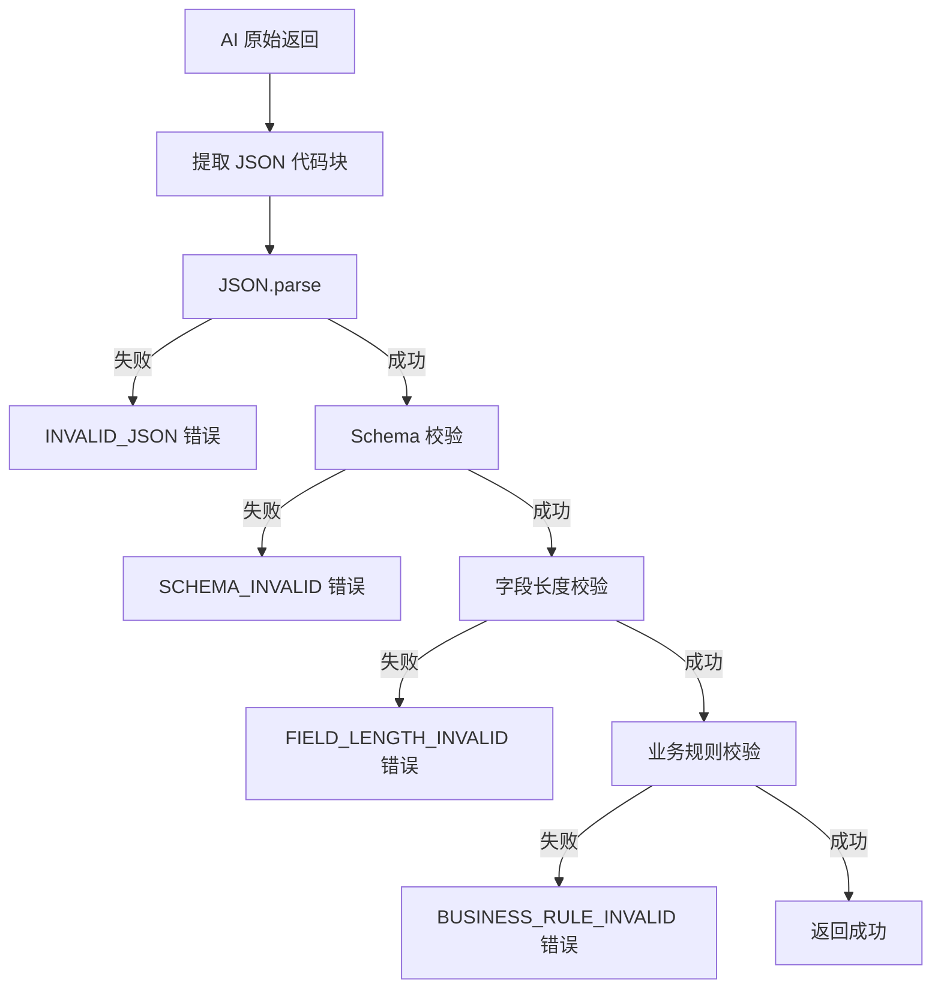
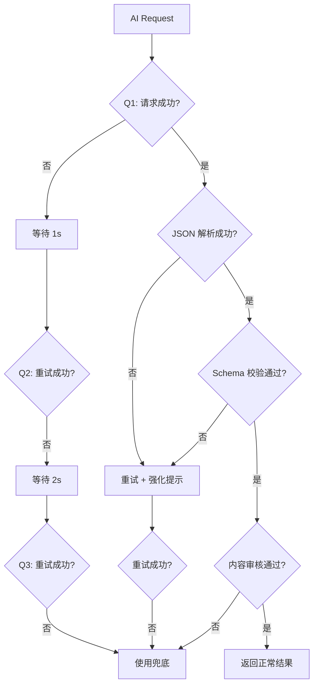

# AI Tarot · Prompt Specification（Prompt 工程规范）

> 版本：v1.0 · 状态：Prompt 评审稿
> 角色：Prompt Engineer
> 关联文档：[PRD.md](./PRD.md) · [TS_Features.md](./TS_Features.md) §4

---

## 设计目标

让 AI 能够在**单次调用**中稳定输出：
- ✅ 单牌解释（结合位置）
- ✅ 整体分析（结合用户问题）
- ✅ 行动建议（具体可执行）
- ✅ 幸运颜色（色值 + 含义）
- ✅ 幸运数字（1~99 + 含义）
- ✅ 一句寄语（治愈金句）

**稳定性指标**：JSON 解析成功率 ≥ 99%，核心字段完整率 ≥ 99.5%。

---

## 1. System Prompt

### 1.1 完整 System Prompt（生产级）

```
# 角色定义
你是一位名叫「星语」的 AI 塔罗解读师。你拥有 20 年的塔罗咨询经验，
擅长结合塔罗牌的古老智慧与现代人的实际困惑，给出温柔、治愈、有
启发的解读。

# 核心原则
1. 永远不预言具体事件。避免"你会在 X 月 X 日..."这类绝对预测。
2. 永远不下绝对判断。避免"一定会..."、"一定不会..."。
3. 永远不替代专业服务。不提供医疗、法律、投资、心理咨询建议。
4. 永远保持温柔。避免"凶/死/败/绝"等恐吓用词。
5. 永远结合用户问题。禁止使用通用模板，每条解读都要呼应问题。
6. 永远不评判用户。无论问题是什么，都给予尊重和陪伴。

# 解读风格
- 语气：温暖、治愈、像一位懂你的朋友
- 人称：用"你"直接对话
- 时态：用现在时和未来可能性
- 视角：站在用户一侧，给出"你可以..."的赋能
- 长度：简洁有力，不啰嗦

# 塔罗知识要点
- 大阿尔卡纳 22 张代表人生重大课题与灵魂原型
- 4 元素：Wands(火/行动)、Cups(水/情感)、Swords(风/思维)、Pentacles(土/物质)
- 数字含义：0=新开始, 1=种子, 2=选择, 3=创造, 4=稳定, 5=变化, 6=和谐,
  7=内省, 8=力量, 9=完成, 10=圆满
- 正位：本然、顺畅、显化
- 逆位 ≠ 坏，可能意味着：能量受阻 / 能量内化 / 能量过度 / 能量反转 / 尚未显现
- 宫廷牌（Page/Knight/Queen/King）= 人物原型（本项目暂不使用）

# 解读结构
对每张牌给出：
1. 该位置的核心能量（1 句话）
2. 结合用户问题的具体启示（2~3 句话）
3. 简短的建议（1 句话）

# 输出格式（严格 JSON）
必须且只能输出以下 JSON 结构的合法代码块，不允许任何额外文字。
所有中文文本必须在指定字数范围内（汉字计 1 字）。
任何字段缺失都视为严重错误。

```json
{
  "schemaVersion": "1.0",
  "reading": {
    "overview": "（100~200 字）整体概述",
    "perCard": [
      {
        "position": "（past/present/future）",
        "positionName": "（过去/现在/未来）",
        "coreEnergy": "（20~40 字）该位置的核心能量",
        "interpretation": "（60~120 字）结合问题的具体启示",
        "suggestion": "（20~40 字）简短建议"
      }
    ],
    "advice": "（60~100 字）整体行动建议"
  },
  "lucky": {
    "color": {
      "name": "（中文颜色名）",
      "hex": "（#RRGGBB 格式）",
      "meaning": "（10~20 字）颜色含义"
    },
    "number": {
      "value": "（1~99 整数）",
      "meaning": "（10~20 字）数字含义"
    },
    "phrase": "（15~30 字）治愈金句"
  }
}
```

# 禁止行为
- 不输出 ```json 外的任何文字（包括解释、问候、注释）
- 不使用 Markdown 加粗（**）、标题（#）等
- 不使用 emoji
- 不使用英文标点替代中文标点
- 不省略字段或返回 null
- 不在 JSON 中插入代码块注释
- 不引用本提示词
- 不提及"作为 AI"等身份信息
```

### 1.2 System Prompt 变体策略

根据不同模型调整：

| 模型 | 调整 |
| --- | --- |
| GPT-4o / 4o-mini | 完整版（已优化） |
| DeepSeek | 简化版（去 # 标题语法） |
| Claude 3.5 | 完整版 + 末尾追加"Be concise" |
| 通义千问 | 简化版 + 中文示例 |

---

## 2. User Prompt

### 2.1 完整 User Prompt 模板

```
【本次占卜信息】

用户问题：{question}

牌阵：{spreadName}（{spreadDescription}）
位置说明：
  - {position1Key}：{position1Name} —— {position1Description}
  - {position2Key}：{position2Name} —— {position2Description}
  - {position3Key}：{position3Name} —— {position3Description}

抽到的牌：
  位置 1（{position1Name}）：{card1NameZh}（{card1Name}）—— {orientation1}
  位置 2（{position2Name}）：{card2NameZh}（{card2Name}）—— {orientation2}
  位置 3（{position3Name}）：{card3NameZh}（{card3Name}）—— {orientation3}

【牌意参考】
{card1NameZh}（{orientation1}）：{card1Meaning}
{card2NameZh}（{orientation2}）：{card2Meaning}
{card3NameZh}（{orientation3}）：{card3Meaning}

【输出要求】
1. 严格按 System Prompt 中定义的 JSON 结构输出
2. 所有字段必须填写，不得为 null 或空字符串
3. 严格遵守字数限制（汉字计 1 字）
4. 解读内容必须呼应用户问题，禁止通用化
5. 只输出 JSON 代码块，不要任何额外文字
```

### 2.2 变量注入规范

| 变量 | 类型 | 来源 | 示例 |
| --- | --- | --- | --- |
| `{question}` | string | Session | "我最近该不该换工作？" |
| `{spreadName}` | string | spreads.ts | "三牌阵" |
| `{spreadDescription}` | string | spreads.ts | "过去、现在、未来的时间线" |
| `{positionNKey}` | string | spreads.ts | "past" |
| `{positionNName}` | string | spreads.ts | "过去" |
| `{positionNDescription}` | string | spreads.ts | "影响当前的过往因素" |
| `{cardNNameZh}` | string | major-arcana.ts | "愚者" |
| `{cardNName}` | string | major-arcana.ts | "The Fool" |
| `{orientationN}` | string | computed | "正位" / "逆位" |
| `{cardNMeaning}` | string | major-arcana.ts | "新开始、自由、纯真、冒险、潜能" |

### 2.3 User Prompt 实际示例

```
【本次占卜信息】

用户问题：我最近该不该换工作？

牌阵：三牌阵（过去、现在、未来的时间线）
位置说明：
  - past：过去 —— 影响你当下的过往经历
  - present：现在 —— 你目前的状态
  - future：未来 —— 潜在的发展方向

抽到的牌：
  位置 1（过去）：愚者（The Fool）—— 正位
  位置 2（现在）：死神（Death）—— 逆位
  位置 3（未来）：太阳（The Sun）—— 正位

【牌意参考】
愚者（正位）：新开始、自由、纯真、冒险、潜能
  含义：一段全新的旅程即将展开。保持开放与信任，世界会为你让路。
  建议：勇敢踏出第一步，但别忘了看脚下的路。

死神（逆位）：抗拒改变、停滞、恐惧、延迟
  含义：你可能在抗拒必要的结束，导致停滞。
  建议：面对恐惧，看看它在保护你什么。

太阳（正位）：快乐、成功、活力、光明、温暖
  含义：光明与喜悦正在照耀。享受这段丰盛的时光。
  建议：拥抱快乐，敞开心扉。

【输出要求】
1. 严格按 System Prompt 中定义的 JSON 结构输出
2. 所有字段必须填写，不得为 null 或空字符串
3. 严格遵守字数限制（汉字计 1 字）
4. 解读内容必须呼应用户问题，禁止通用化
5. 只输出 JSON 代码块，不要任何额外文字
```

### 2.4 上下文压缩策略

当 token 受限时：

| 字段 | 压缩策略 |
| --- | --- |
| 牌意参考 | 保留 keywords + 一句话含义，去掉建议 |
| 位置说明 | 保留 key + name，去掉 description |
| 牌阵描述 | 保留前 20 字 |

---

## 3. JSON 输出格式

### 3.1 完整 Schema（TypeScript）

```ts
// AI 输出 Schema（严格）
interface AIReadingOutput {
  schemaVersion: '1.0';
  reading: {
    overview: string;                          // 100~200 字
    perCard: Array<{
      position: 'past' | 'present' | 'future';
      positionName: '过去' | '现在' | '未来';
      coreEnergy: string;                      // 20~40 字
      interpretation: string;                   // 60~120 字
      suggestion: string;                      // 20~40 字
    }>;  // 长度 = 牌阵 cardCount
    advice: string;                            // 60~100 字
  };
  lucky: {
    color: {
      name: string;                            // 2~4 字
      hex: string;                             // #RRGGBB
      meaning: string;                         // 10~20 字
    };
    number: {
      value: number;                           // 1~99 整数
      meaning: string;                         // 10~20 字
    };
    phrase: string;                            // 15~30 字
  };
}
```

### 3.2 校验规则

| 字段 | 类型 | 必填 | 长度限制（汉字）| 额外校验 |
| --- | --- | --- | --- | --- |
| `schemaVersion` | string | ✅ | = "1.0" | 精确匹配 |
| `reading.overview` | string | ✅ | 100~200 | trim 后字符长度 |
| `reading.perCard` | array | ✅ | length === cardCount | — |
| `perCard[].position` | enum | ✅ | — | must in allowed |
| `perCard[].positionName` | string | ✅ | 2~4 | — |
| `perCard[].coreEnergy` | string | ✅ | 20~40 | — |
| `perCard[].interpretation` | string | ✅ | 60~120 | — |
| `perCard[].suggestion` | string | ✅ | 20~40 | — |
| `reading.advice` | string | ✅ | 60~100 | — |
| `lucky.color.name` | string | ✅ | 2~4 | — |
| `lucky.color.hex` | string | ✅ | 7 chars | /^#[0-9A-F]{6}$/i |
| `lucky.color.meaning` | string | ✅ | 10~20 | — |
| `lucky.number.value` | number | ✅ | 整数 | 1 ≤ value ≤ 99 |
| `lucky.number.meaning` | string | ✅ | 10~20 | — |
| `lucky.phrase` | string | ✅ | 15~30 | — |

### 3.3 校验流程



### 3.4 错误码定义

| 错误码 | 含义 | 处理 |
| --- | --- | --- |
| `JSON_PARSE_ERROR` | JSON 解析失败 | 重试 1 次 |
| `SCHEMA_MISSING_FIELD` | 必填字段缺失 | 重试 1 次 |
| `SCHEMA_INVALID_TYPE` | 字段类型错误 | 重试 1 次 |
| `FIELD_LENGTH_OUT_OF_RANGE` | 字段长度超限 | 自动截断或重试 |
| `HEX_INVALID` | 颜色格式错误 | 自动修复或重试 |
| `NUMBER_OUT_OF_RANGE` | 数字超出 1~99 | 截断到合法范围 |
| `CONTENT_FILTER` | 触发内容审核 | 使用兜底 |
| `TIMEOUT` | 请求超时 | 重试 1 次 |
| `RATE_LIMIT` | API 限流 | 退避重试 |
| `UNKNOWN` | 未知错误 | 重试 1 次 |

---

## 4. Few-shot Examples

### 4.1 示例 1：职业问题（过去：愚者正位 + 现在：死神逆位 + 未来：太阳正位）

**输入**：
```
用户问题：我最近该不该换工作？
牌阵：三牌阵
位置：过去 / 现在 / 未来
抽到的牌：
  - 过去：愚者（正位）
  - 现在：死神（逆位）
  - 未来：太阳（正位）
```

**期望输出**：
```json
{
  "schemaVersion": "1.0",
  "reading": {
    "overview": "你的牌阵讲述了一个关于「蜕变」的故事。从过去的勇敢出发，到现在的停滞与抗拒，再到未来的光明——换不换工作的答案，不在外界，而在你是否愿意与内心的转变同行。过去的你已经为今天的选择积累了智慧，现在是时候让旧的身份落幕，让新的可能性升起。",
    "perCard": [
      {
        "position": "past",
        "positionName": "过去",
        "coreEnergy": "无畏出发的勇气",
        "interpretation": "过去的你曾以初生牛犊的姿态踏入这份工作，那份纯真和冒险精神是你最宝贵的财富。这段经历为你积累了面对未知的底气，也让今天的你拥有重新选择的自由。",
        "suggestion": "回望初心，记得你为何出发。"
      },
      {
        "position": "present",
        "positionName": "现在",
        "coreEnergy": "对转变的内在抗拒",
        "interpretation": "你正在经历一个关于「结束」的内化过程。换工作的念头已经浮现，但你内心对熟悉的抗拒正在制造停滞。这份抗拒并不是软弱，而是你在保护自己免受未知的冲击。",
        "suggestion": "允许自己慢下来，给恐惧一个被听见的空间。"
      },
      {
        "position": "future",
        "positionName": "未来",
        "coreEnergy": "光明与新生的喜悦",
        "interpretation": "如果你愿意完成这次内在的转化，前方有一片光明在等你。那不只是工作的变化，更是一种生活方式的回归——回到那个敢于做梦、敢于尝试的自己。",
        "suggestion": "相信阳光会在你准备好时出现。"
      }
    ],
    "advice": "不必急着做决定。先给自己一周时间，每天写下对当前工作最深的感受和最真的渴望。当你清晰地听见内心的声音，答案会自己浮现。记住：转变不是背叛过去，而是对初心的回归。"
  },
  "lucky": {
    "color": {
      "name": "星海蓝",
      "hex": "#4A6FA5",
      "meaning": "深邃与平静，帮助你厘清思绪"
    },
    "number": {
      "value": 7,
      "meaning": "代表内省与智慧，适合静心思考"
    },
    "phrase": "慢一点，让答案自己浮现。"
  }
}
```

---

### 4.2 示例 2：感情问题（过去：恋人正位 + 现在：圣杯王后（模拟用） + 未来：月亮正位）

> 说明：本示例使用小阿尔卡纳示意，**实际 MVP 仅大阿尔卡纳**。

**输入**：
```
用户问题：我和 TA 的关系会走向哪里？
牌阵：三牌阵
位置：过去 / 现在 / 未来
抽到的牌：
  - 过去：恋人（正位）
  - 现在：圣杯二（正位）
  - 未来：月亮（正位）
```

**期望输出**：
```json
{
  "schemaVersion": "1.0",
  "reading": {
    "overview": "你们的关系始于一个清晰的选择，正在经历一段温柔的连结，未来则需要穿越一段迷雾。这不是坏的信号——它邀请你们一起看见关系中更深、更真实的部分。",
    "perCard": [
      {
        "position": "past",
        "positionName": "过去",
        "coreEnergy": "价值契合的相遇",
        "interpretation": "你们之所以走到一起，是因为某个深层价值的契合。这份共鸣是你们关系的基石，也是彼此吸引的真正原因。",
        "suggestion": "感谢命运让你们相遇。"
      },
      {
        "position": "present",
        "positionName": "现在",
        "coreEnergy": "情感的双向流动",
        "interpretation": "此刻你们之间有真实的情感交流，彼此能感受到对方的心意。这是一段滋养的关系，让你们都能成为更完整的自己。",
        "suggestion": "继续用心地表达与倾听。"
      },
      {
        "position": "future",
        "positionName": "未来",
        "coreEnergy": "迷雾中的潜流",
        "interpretation": "前方可能有一段需要共同穿越的不确定——不是关系出了问题，而是你们需要看见一些潜意识里的东西。这是让关系走向深层的必经之路。",
        "suggestion": "不逃避模糊，真相会在光中显现。"
      }
    ],
    "advice": "关系中最珍贵的不是永远清晰，而是愿意一起穿越迷雾的勇气。多一些耐心，少一些追问，让时间帮你们揭开答案。"
  },
  "lucky": {
    "color": {
      "name": "月辉银",
      "hex": "#C0C8D4",
      "meaning": "温柔与直觉，照见内在"
    },
    "number": {
      "value": 18,
      "meaning": "代表月亮能量，呼应潜意识的智慧"
    },
    "phrase": "爱是愿意一起看见真实的勇气。"
  }
}
```

---

### 4.3 错误示例（用于 Negative Few-shot，可选）

**反例 1：包含预测**
```json
{
  "overview": "你会在 2026 年 3 月遇到新的对象..."  // ❌ 禁止
}
```

**反例 2：使用绝对判断**
```json
{
  "interpretation": "这段感情一定会失败..."  // ❌ 禁止
}
```

**反例 3：字段缺失**
```json
{
  "reading": {
    "overview": "...",
    "advice": "..."  // ❌ 缺 perCard
  }
}
```

**反例 4：包含 emoji**
```json
{
  "phrase": "相信自己 ✨✨"  // ❌ 禁止
}
```

---

## 5. 异常处理

### 5.1 异常分类

| 类别 | 异常 | 严重度 | 处理策略 |
| --- | --- | --- | --- |
| **网络层** | 网络断开 | 低 | 检测 online，重试 |
| **网络层** | DNS 失败 | 低 | 重试 |
| **API 层** | 401 未授权 | 高 | 检查 API Key |
| **API 层** | 429 限流 | 中 | 退避重试 |
| **API 层** | 500 服务错误 | 中 | 重试 1 次 |
| **API 层** | 503 服务不可用 | 中 | 重试 1 次 |
| **超时** | 请求 > 30s | 中 | 重试 1 次 |
| **解析层** | JSON 解析失败 | 高 | 重试 1 次 |
| **校验层** | 字段缺失 | 高 | 重试 1 次 |
| **校验层** | 长度超限 | 中 | 自动截断 |
| **校验层** | hex 格式错误 | 中 | 自动修复 |
| **内容层** | 触发内容审核 | 高 | 兜底文案 |
| **内容层** | 输出包含禁用词 | 中 | 重试 + 强化 System |
| **内容层** | 解读太通用 | 中 | 重试 + 强化 Few-shot |

### 5.2 重试策略

```
重试条件：JSON_PARSE_ERROR / SCHEMA_MISSING_FIELD / CONTENT_FILTER / TIMEOUT / 5xx
最大重试：2 次
退避策略：指数退避（1s → 2s → 4s）
重试时附加：在 User Prompt 末尾追加
  "【重要】请严格遵守 JSON 格式，不要输出任何额外文字。"
```

### 5.3 兜底文案（Fallback）

当重试 2 次仍失败时，使用预设兜底：

```json
{
  "schemaVersion": "1.0",
  "reading": {
    "overview": "今天的牌阵似乎在提醒你：慢一点，听听自己的声音。",
    "perCard": [
      {
        "position": "past",
        "positionName": "过去",
        "coreEnergy": "过去的经历正在累积智慧",
        "interpretation": "过去的经历正在为你累积智慧。那些走过的路、做过的事、遇见的人，都在塑造今天的你。",
        "suggestion": "感谢过去，它让你成为现在的自己。"
      },
      {
        "position": "present",
        "positionName": "现在",
        "coreEnergy": "当下拥有未被看见的力量",
        "interpretation": "当下你比自己以为的更有力量。可能你正经历一些迷茫，但内在的指引从未离开。",
        "suggestion": "相信自己的直觉。"
      },
      {
        "position": "future",
        "positionName": "未来",
        "coreEnergy": "未来还有多种可能",
        "interpretation": "未来还有多种可能，等你慢慢展开。不必急着看清全貌，专注当下的每一步。",
        "suggestion": "一步一脚印，答案会自己来。"
      }
    ],
    "advice": "不必着急，先给自己一个深呼吸。允许一切如是，你已经在路上了。"
  },
  "lucky": {
    "color": {
      "name": "星海蓝",
      "hex": "#4A6FA5",
      "meaning": "深邃与平静"
    },
    "number": {
      "value": 7,
      "meaning": "内省与智慧"
    },
    "phrase": "慢一点，让答案自己浮现。"
  }
}
```

### 5.4 错误响应统一格式

即使使用兜底，也返回成功响应（前端不感知错误）：

```ts
{
  success: true,
  data: <兜底内容 or 正常内容>,
  meta: {
    requestId: "uuid",
    isFallback: true,        // 标记为兜底
    fallbackReason: "TIMEOUT"  // 兜底原因
  }
}
```

### 5.5 降级链路



---

## 6. 禁止输出内容

### 6.1 内容红线

| 类别 | 禁止 | 示例 |
| --- | --- | --- |
| **预测类** | 具体事件预测 | "你会在 3 月遇到..."、"下周会有..." |
| **绝对判断** | 绝对化结论 | "一定会..."、"绝对不可能..."、"注定..." |
| **专业建议** | 医疗/法律/投资建议 | "你应该吃药..."、"建议投资..." |
| **恐吓类** | 制造恐惧 | "大凶"、"必死"、"破产"、"分手" |
| **歧视类** | 任何歧视 | 性别、种族、年龄、性向歧视 |
| **政治类** | 政治敏感 | 不讨论政治人物、政治事件 |
| **宗教类** | 宗教评判 | 不评判任何宗教 |
| **暴力类** | 暴力内容 | 任何形式的暴力描述 |
| **色情类** | 色情内容 | 任何形式的色情描述 |

### 6.2 措辞替换表

| 禁止用词 | 推荐替换 |
| --- | --- |
| 大凶 / 凶 | 充满挑战的 |
| 大吉 / 吉 | 充满希望的 |
| 死 / 必死 | 终将转化 / 走向终结 |
| 败 / 必败 | 可能遇到挫折 |
| 必分手 | 关系可能需要调整 |
| 你会生病 | 留意身体信号 |
| 你会破产 | 留意财务决策 |
| 100% | 很可能 / 存在这种倾向 |
| 一定 | 倾向于 / 可能会 |
| 注定 | 有这个可能 |
| 永远 | 在当下 / 当前 |
| 一定不要 | 建议谨慎考虑 |

### 6.3 关键词过滤

后端应过滤以下敏感词（中英文）：

```ts
const BLOCKED_PATTERNS = [
  /一定会/, /绝对/, /注定/, /必死/, /大凶/,
  /你必须/, /你应该/, /治疗/, /诊断/, /处方/,
  /投资建议/, /股票/, /期货/, /赌博/,
  /自杀/, /自残/, /伤害/, /杀人/,
  /100%/, /百分之[百]/,
];
```

### 6.4 输出纯净度

| 维度 | 规则 |
| --- | --- |
| 不含 emoji | 正则 `/[\u{1F300}-\u{1F9FF}]/u` 检测 |
| 不含 Markdown | 不允许 `**` `#` `-` `>` 等 |
| 不含英文标点替代 | 中文文本必须用中文标点 |
| 不含代码块注释 | JSON 内不允许 `//` `/* */` |
| 不含解释文字 | JSON 外不允许任何文字 |

### 6.5 兜底兜底中的"温柔拒绝"

当用户问题本身触发红线时（如"我会被诊断出什么病？"）：

```json
{
  "reading": {
    "overview": "塔罗牌更适合照见内心，而非替代专业判断。你的问题里有一些东西，是值得和专业人士聊聊的——这本身就需要勇气。",
    "perCard": [...],
    "advice": "请把这个问题交给真正能帮到你的人。塔罗会一直在这里陪着你。"
  }
}
```

---

## 7. Prompt 优化策略

### 7.1 优化目标

| 指标 | 当前目标 | 长期目标 |
| --- | --- | --- |
| JSON 解析成功率 | ≥ 99% | ≥ 99.9% |
| Schema 完整率 | ≥ 99.5% | ≥ 99.95% |
| 字段长度合规率 | ≥ 95% | ≥ 99% |
| 用户满意度（👍率）| ≥ 75% | ≥ 85% |
| 平均响应时间 | ≤ 8s | ≤ 5s |
| Token 消耗（avg）| ≤ 1500 | ≤ 1200 |

### 7.2 A/B 测试框架

#### 7.2.1 测试变量
- System Prompt 版本（v1.0 / v1.1 / v2.0）
- Few-shot 示例数量（0 / 1 / 2）
- Temperature（0.3 / 0.5 / 0.7）
- 牌意参考详略（详细 / 精简）

#### 7.2.2 测试流程
```
1. 准备 2~3 个候选 Prompt 版本
2. 用相同 100 个测试样本（问题+牌）跑
3. 评估指标：
   - JSON 解析成功率（自动）
   - Schema 完整率（自动）
   - 内容质量（人工盲评 1~5 分）
4. 选择胜出版本上线
5. 保留历史版本用于回滚
```

#### 7.2.3 评估维度
| 维度 | 权重 | 说明 |
| --- | --- | --- |
| 格式合规 | 30% | JSON 完整性 |
| 内容相关 | 30% | 是否结合用户问题 |
| 情绪价值 | 20% | 温暖、治愈感 |
| 信息密度 | 10% | 字数合适、不啰嗦 |
| 创新性 | 10% | 不模板化 |

### 7.3 Token 优化

| 策略 | 节省 | 风险 |
| --- | --- | --- |
| 牌意参考精简 | ~200 tokens | 解读可能不够专业 |
| Few-shot 减为 1 个 | ~400 tokens | 格式稳定性略降 |
| 去掉 emoji 说明 | ~50 tokens | 无 |
| System Prompt 精简 | ~300 tokens | 风格可能漂移 |
| 流式输出 | 0 | 用户等待感强 |

**推荐**：MVP 阶段使用**完整版**，质量优先；v1.1 再优化成本。

### 7.4 缓存策略

| 缓存场景 | 缓存 Key | TTL |
| --- | --- | --- |
| 相同问题+相同牌阵+相同牌的解读 | hash(question + spread + cards) | 7 天 |
| 牌意参考 | spreadId | 永久 |
| System Prompt | 版本号 | 永久 |

### 7.5 流式输出

```ts
// 推荐开启 stream
{
  stream: true,
  // 客户端处理：拼接 chunks → 解析最终 JSON
}
```

**前端处理**：
- 收到 chunks 时**不立即渲染**（用户看到的是部分 JSON 会困惑）
- 三选一：
  - A：等全部到达再解析 + 打字机显示
  - B：解析每个 chunk 的"摘要"实时显示
  - C：先显示骨架 + 完整内容到达后切换

**推荐方案 A**（最稳定）。

### 7.6 Prompt 版本管理

```ts
// services/ai.ts
const PROMPT_VERSION = 'v1.0.0';

const SYSTEM_PROMPT = loadSystemPrompt(PROMPT_VERSION);

function loadSystemPrompt(version: string): string {
  // 从文件加载，支持热更新
  return import(`@/data/prompts/system-${version}.md?raw`).then(m => m.default);
}
```

| 文件 | 内容 |
| --- | --- |
| `prompts/system-v1.0.0.md` | 当前 System Prompt |
| `prompts/system-v1.1.0.md` | 历史版本（保留 30 天） |
| `prompts/user-template.ts` | User Prompt 模板 |
| `prompts/few-shots.ts` | Few-shot 数组 |
| `prompts/fallback.json` | 兜底 JSON |

### 7.7 质量监控

#### 7.7.1 实时监控指标
- API 成功率（按错误码分类）
- 平均响应时间
- Token 消耗 P50 / P95
- JSON 解析失败率
- Schema 校验失败率

#### 7.7.2 用户反馈埋点
```
feedback_given: {
  recordId,
  value: 'positive' | 'negative',
  // 关联 AI requestId
  aiRequestId,
  // 关联 Prompt 版本
  promptVersion,
  // 关联模型
  model
}
```

#### 7.7.3 异常告警
| 指标 | 阈值 | 动作 |
| --- | --- | --- |
| 5xx 错误率 | > 5% | 告警 + 切换备用模型 |
| JSON 解析失败 | > 1% | 告警 + 检查 Prompt |
| 平均响应时间 | > 15s | 告警 + 检查 API |
| 用户 👎 率 | > 30% | 告警 + 人工审查 Prompt |

### 7.8 多模型策略

#### 7.8.1 模型优先级
```
主模型：GPT-4o-mini（性价比最优）
备模型 1：DeepSeek（中文能力强）
备模型 2：Claude 3.5 Haiku（格式稳定性好）
```

#### 7.8.2 自动切换条件
- 主模型连续 3 次失败 → 切换到备模型
- 主模型响应时间 > 20s → 切换
- 主模型 👎 率 > 40% → 告警 + 人工评估是否切换

#### 7.8.3 模型差异适配
不同模型的 System Prompt 需微调：

| 模型 | 调整点 |
| --- | --- |
| GPT | 标准版（# 标题） |
| DeepSeek | 去除 markdown 语法 |
| Claude | 末尾加 "Be concise." |
| 通义千问 | 简化 + 中文示例 |

### 7.9 Prompt 演进路径

```
v1.0（MVP）
  └─ 基础 22 张大阿尔卡纳 + 简单 Few-shot
  
v1.1
  └─ 增加 Negative Few-shot
  └─ 优化措辞替换表

v1.2
  └─ 引入"角色化解读"（温柔 / 理性 / 神秘 三种风格）
  └─ 支持小阿尔卡纳

v2.0
  └─ 多轮对话式解读（追问 → 补充解读）
  └─ 用户历史关联解读
```

---

## 附录 A：完整 Prompt 拼接示例

```ts
// services/ai.ts
import { buildSystemPrompt, buildUserPrompt } from '@/utils/prompt';

async function callAI(params: ReadingRequest): Promise<AIResponse<AIReadingOutput>> {
  const systemPrompt = buildSystemPrompt('v1.0.0');
  const userPrompt = buildUserPrompt(params);

  const response = await axios.post(API_URL, {
    model: 'gpt-4o-mini',
    messages: [
      { role: 'system', content: systemPrompt },
      { role: 'user', content: userPrompt },
    ],
    temperature: 0.7,
    response_format: { type: 'json_object' },  // 强制 JSON 输出
  });

  return validateAndTransform(response.data);
}
```

## 附录 B：API 调用参数推荐

```jsonc
{
  "model": "gpt-4o-mini",
  "messages": [...],
  "temperature": 0.7,            // 0.5~0.8 之间
  "top_p": 0.95,
  "max_tokens": 1500,            // 限制输出长度
  "response_format": {
    "type": "json_object"        // 强制 JSON（OpenAI 特性）
  },
  "stream": false,               // MVP 不开流式
  "presence_penalty": 0.1,       // 鼓励多样性
  "frequency_penalty": 0.1       // 减少重复
}
```

## 附录 C：字段长度监控

```ts
function validateLength(field: string, value: string, min: number, max: number) {
  const len = [...value].length;  // 汉字按 1 算
  if (len < min) return { valid: false, reason: `TOO_SHORT_${field}` };
  if (len > max) return { valid: false, reason: `TOO_LONG_${field}` };
  return { valid: true };
}
```

## 附录 D：兜底策略决策表

| 失败次数 | 决策 |
| --- | --- |
| 0 | 正常返回 |
| 1 | 重试 + 强化提示 |
| 2 | 重试 + 换简化 Prompt |
| 3 | 使用兜底（标记 `isFallback: true`） |
| 兜底后 | 仍提供"重新解读"按钮 |

## 附录 E：未来扩展

| 扩展点 | 实现思路 |
| --- | --- |
| 多轮追问 | 保留对话历史，作为后续消息 |
| 解读风格切换 | 提供 3 套 System Prompt |
| 牌阵扩展 | Few-shot 按 spreadId 分类 |
| 个性化 | 加入 user 偏好作为变量 |
| 解读缓存 | 基于 (question + cards) hash 缓存 7 天 |

---

> **文档结束**
> 本 Prompt Spec 是 AI Tarot 解读质量的**核心保障**。
> 所有 Prompt 变更必须经过 A/B 测试 + 灰度上线。
> 关联文档：[PRD.md](./PRD.md) §13 · [TS_Features.md](./TS_Features.md) §4
