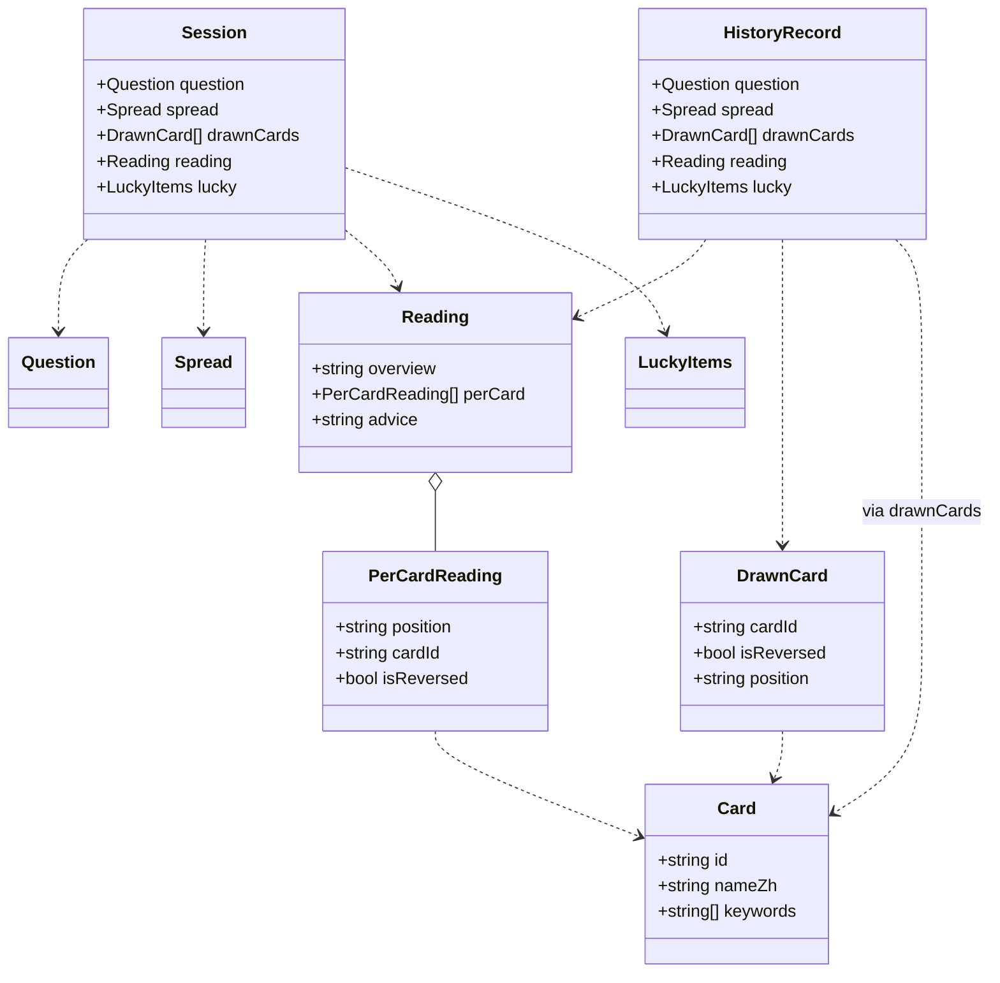
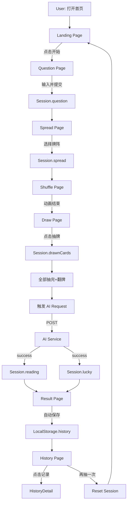
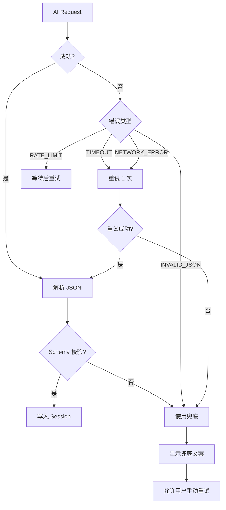

# AI Tarot · TS-Features（功能设计规格）

> 版本：v1.0 · 状态：功能设计评审稿
> 角色：Senior Product Architect / Full-stack Engineer
> 关联文档：[PRD.md](./PRD.md) · [TS_Architecture.md](./TS_Architecture.md)
> 设计原则：**不写实现代码，只描述设计方案**

---

## 1. 页面设计

> 7 个核心页面，每个页面均按"七要素"标准化设计。

---

### 1.1 Landing（首页 `/`）

| 维度 | 设计 |
| --- | --- |
| **页面目标** | 30 秒内传达产品价值，引导用户开启首次占卜 |
| **主要功能** | 品牌展示 / 主 CTA 按钮 / 副 CTA 入口 / 背景动效 |
| **页面状态** | `idle`（无操作态） |
| **用户操作** | 点击「开始占卜」/ 点击「查看历史」/ 滚动浏览 |
| **页面跳转** | 「开始占卜」→ `/question`；「查看历史」→ `/history`（无历史时按钮置灰） |
| **异常处理** | LocalStorage 不可用时，副 CTA 隐藏；图片加载失败时降级为文字版式 |
| **需要的数据** | `LocalStorage.history.length`（用于副 CTA 显隐）；`Settings.theme` |

#### 状态机
```
IDLE
  ├─ [click primary CTA] → navigate(/question)
  └─ [click secondary CTA] → navigate(/history)
```

---

### 1.2 Question（问题输入页 `/question`）

| 维度 | 设计 |
| --- | --- |
| **页面目标** | 帮助用户聚焦内心，写下想问的问题 |
| **主要功能** | 文本输入 / 字符计数 / 引导文案 / 草稿自动保存 |
| **页面状态** | `empty` / `typing` / `valid` / `submitting` |
| **用户操作** | 输入文本 / 清空 / 提交（点击「下一步」）/ 离开页面 |
| **页面跳转** | 提交成功 → `/spread`；离开未提交 → `beforeunload` 提示 |
| **异常处理** | 纯空格/符号 → 视为空，按钮置灰；超 100 字截断；草稿恢复时显示提示 |
| **需要的数据** | `Session.question`（写入）；`LocalStorage.draft`（恢复） |

#### 状态机
```
EMPTY ──[input]──> TYPING ──[validate]──> VALID
                                          │
                                       [submit]
                                          ↓
                                    SUBMITTING
                                          │
                                    [success] → navigate(/spread)
```

#### 校验规则
- 最少 2 个有效字符（中文）/ 4 个有效字符（英文）
- 纯空格、纯符号、纯 emoji → 视为无效
- 上限 100 字符（超长截断并提示）

---

### 1.3 Spread（牌阵选择页 `/spread`）

| 维度 | 设计 |
| --- | --- |
| **页面目标** | 让用户选择解读的展开方式 |
| **主要功能** | 牌阵卡片展示 / 选中态 / 提示 disabled 牌阵 |
| **页面状态** | `idle` / `selecting` / `confirmed` |
| **用户操作** | 鼠标悬浮 / 选中 / 点击「开始洗牌」 |
| **页面跳转** | 确认 → `/shuffle` |
| **异常处理** | 路由守卫：未填写问题 → 自动跳回 `/question` |
| **需要的数据** | `Session.question`（守卫）；`spreads.ts`（牌阵列表） |

#### 状态机
```
IDLE ──[hover]──> SELECTING ──[click]──> CONFIRMED
                                            │
                                         [confirm]
                                            ↓
                                      navigate(/shuffle)
```

---

### 1.4 Shuffle（洗牌动画页 `/shuffle`）

| 维度 | 设计 |
| --- | --- |
| **页面目标** | 营造仪式感，让用户"交出主动权" |
| **主要功能** | 洗牌动画 / 动态文案 / 跳过按钮 |
| **页面状态** | `playing` / `finished` / `skipped` |
| **用户操作** | 等待动画 / 点击「跳过」 |
| **页面跳转** | 动画结束或跳过 → `/draw`（延时 500ms） |
| **异常处理** | 动画卡死（>5s）→ 自动跳过；页面刷新 → 重新进入 |
| **需要的数据** | `Session.spreadType`（决定后续抽几张） |

#### 状态机
```
PLAYING ──[animation end]──> FINISHED ──[delay 500ms]──> navigate(/draw)
       └─[click skip]────────────────────> SKIPPED ─────> navigate(/draw)
```

---

### 1.5 Draw（抽牌 + 翻牌 + 解读触发页 `/draw`）

| 维度 | 设计 |
| --- | --- |
| **页面目标** | 用户主动抽取牌 + 触发 AI 解读 |
| **主要功能** | 抽牌交互 / 翻牌动画 / 位置标签 / 进度条 / 自动触发 AI 解读 |
| **页面状态** | `ready` / `drawing` / `flipping` / `calling-ai` / `revealed` |
| **用户操作** | 点击牌堆抽牌 / 点击牌面翻牌 / 等待 AI / 查看解读 |
| **页面跳转** | 解读完成 → `/result`（2s 后自动跳转或点击按钮） |
| **异常处理** | 抽牌中刷新 → 跳回 `/shuffle`；AI 失败 → 内嵌重试 / 跳转兜底 |
| **需要的数据** | `Session.drawnCards`（写入）；`Session.reading`（AI 写入） |

#### 状态机
```
READY ──[click deck]──> DRAWING ──[count = N]──> FLIPPING
                                                     │
                                              [all flipped]
                                                     ↓
                                              CALLING-AI
                                                     │
                                              [success/error]
                                                     ↓
                                                REVEALED
                                                     │
                                              [delay 2s / click]
                                                     ↓
                                            navigate(/result)
```

#### 抽牌规则
- 抽牌顺序：从上到下依次抽
- 单次抽 1 张，飞入对应位置
- 全部抽完前不可跳过
- 已抽位置不可重复抽

#### 翻牌规则
- 用户可点击单张牌翻看
- 或点击「全部翻开」一键翻转
- 翻牌序列：间隔 800ms
- 翻完后 1.5s 自动触发 AI 请求

---

### 1.6 Result（结果页 `/result`）

| 维度 | 设计 |
| --- | --- |
| **页面目标** | 仪式感收尾 + 引发分享与保存 |
| **主要功能** | AI 解读展示 / 幸运元素 / 寄语 / 反馈 / 操作入口 |
| **页面状态** | `loading` / `success` / `error` / `saved` |
| **用户操作** | 滚动阅读 / 点击反馈（👍/👎）/ 重新占卜 / 查看历史 |
| **页面跳转** | 「再抽一次」→ `/`（重置 Session）；「查看历史」→ `/history` |
| **异常处理** | 解读渲染失败 → 显示兜底文案；分享 API 不可用 → 降级为复制 |
| **需要的数据** | `Session.reading` / `Session.lucky`（读取）；`LocalStorage.history`（写入） |

#### 自动保存策略
- 进入 Result 页即**自动保存**到 LocalStorage（无需用户点击）
- Toast 提示"已保存到历史"
- 重复进入同一会话（同 question）→ 覆盖而非追加

---

### 1.7 History（历史记录页 `/history`）

| 维度 | 设计 |
| --- | --- |
| **页面目标** | 让用户回顾"占卜日记" |
| **主要功能** | 列表展示 / 时间筛选 / 关键词搜索 / 空状态 / 删除 / 详情 |
| **页面状态** | `loading` / `empty` / `loaded` / `searching` / `confirming-delete` |
| **用户操作** | 滚动 / 搜索 / 筛选 / 点击 / 长按删除 / 全部清空 |
| **页面跳转** | 点击记录 → `/history/:id` |
| **异常处理** | 解析失败记录 → 静默跳过 + 控制台 warn；LocalStorage 不可用 → 提示降级 |
| **需要的数据** | `LocalStorage.history`（读取） |

#### 列表项字段
- 日期（相对时间："3 天前" / 绝对时间）
- 问题前 30 字 + 省略号
- 牌阵标签（chip）
- 第一张牌缩略图
- 操作：查看 / 删除

#### 搜索与筛选
- 搜索：匹配 question 文本（中文 / 英文，不区分大小写）
- 筛选：全部 / 本周 / 本月
- 排序：按时间倒序

---

## 2. 数据模型

> 所有数据结构用 TypeScript Interface 描述。

### 2.1 Card（塔罗牌）

```ts
interface Card {
  id: string;                        // 唯一 ID: "major-00"
  name: string;                      // 英文名: "The Fool"
  nameZh: string;                    // 中文名: "愚者"
  arcana: 'major' | 'minor';         // 大/小阿尔卡纳
  number: number;                    // 编号 0~21 (major) / 1~14 (minor)
  suit?: 'wands' | 'cups' | 'swords' | 'pentacles';  // 仅 minor
  rank?: 'ace' | '2' | '3' | '4' | '5' | '6' | '7' | '8' | '9' | '10'
        | 'page' | 'knight' | 'queen' | 'king';       // 仅 minor
  keywords: string[];                // 正位关键词 3~5 个
  reversedKeywords: string[];        // 逆位关键词 2~4 个
  uprightMeaning: string;            // 正位含义 30~80 字
  reversedMeaning: string;           // 逆位含义 30~80 字
  uprightAdvice: string;             // 正位建议 20~40 字
  reversedAdvice: string;            // 逆位建议 20~40 字
  symbolism: string;                 // 核心象征
  element?: 'fire' | 'water' | 'air' | 'earth';  // 元素
  numerology?: number;               // 卡巴拉数 0~21
  treeOfLifePath?: number;           // 生命之树路径 11~32
  hebrewLetter?: string;             // 希伯来字母
  imageUrl: string;                  // 牌面图路径
}
```

### 2.2 Spread（牌阵）

```ts
interface Position {
  key: string;                       // 位置 key: "past" / "present" / "future"
  name: string;                      // 位置名: "过去"
  description?: string;              // 位置含义说明
}

interface Spread {
  id: string;                        // 牌阵 ID: "three-card"
  name: string;                      // 牌阵名: "三牌阵"
  nameEn: string;                    // 英文名: "Three Card"
  description: string;               // 简介
  cardCount: number;                 // 抽牌数量
  positions: Position[];             // 位置定义（顺序敏感）
  enabled: boolean;                  // 是否启用
  complexity: 1 | 2 | 3 | 4 | 5;     // 复杂度
}
```

### 2.3 Question（用户问题）

```ts
interface Question {
  text: string;                      // 原始问题文本
  charCount: number;                 // 字符数
  language: 'zh' | 'en' | 'mixed';   // 语种检测
  category?: 'career' | 'love' | 'self' | 'finance' | 'other';  // 自动归类
  createdAt: number;                 // 提交时间戳
}
```

### 2.4 DrawnCard（抽出的牌）

```ts
interface DrawnCard {
  cardId: string;                    // 牌 ID
  isReversed: boolean;               // 是否逆位
  position: string;                  // 在牌阵中的位置 key
}
```

### 2.5 Reading（AI 解读）

```ts
interface PerCardReading {
  position: string;                  // "past" / "present" / "future"
  positionName: string;              // "过去" / "现在" / "未来"
  cardId: string;                    // 牌 ID
  cardName: string;                  // 牌名（用于缓存展示）
  isReversed: boolean;               // 是否逆位
  interpretation: string;            // 该位置的解读 60~120 字
}

interface Reading {
  overview: string;                  // 整体概述 100~200 字
  perCard: PerCardReading[];         // 每张牌的解读
  advice: string;                    // 整体建议 60~100 字
  generatedAt: number;               // 生成时间戳
  modelUsed: string;                 // 使用的模型标识
  promptVersion: string;             // Prompt 版本号（便于回溯）
}
```

### 2.6 LuckyItems（幸运元素）

```ts
interface LuckyColor {
  name: string;                      // "星海蓝"
  hex: string;                       // "#1E3A8A"
  meaning: string;                   // 含义 10~20 字
}

interface LuckyItems {
  color: LuckyColor;                 // 幸运色
  number: number;                    // 幸运数字 1~99
  numberMeaning: string;            // 数字含义 10~20 字
  phrase: string;                    // 一句话寄语 15~30 字
  phraseAuthor?: string;             // 寄语出处（可选）
}
```

### 2.7 AIResponse（AI 接口统一响应）

```ts
interface AIResponseSuccess<T> {
  success: true;
  data: T;
  usage?: {
    promptTokens: number;
    completionTokens: number;
    totalTokens: number;
  };
  requestId: string;
}

interface AIResponseError {
  success: false;
  error: {
    code: 'TIMEOUT' | 'RATE_LIMIT' | 'INVALID_JSON' | 'CONTENT_FILTER'
        | 'NETWORK_ERROR' | 'UNKNOWN';
    message: string;                 // 给开发看的英文 message
    userMessage: string;             // 给用户看的中文 message
  };
  requestId: string;
}

type AIResponse<T> = AIResponseSuccess<T> | AIResponseError;
```

### 2.8 HistoryRecord（历史记录）

```ts
interface HistoryRecord {
  id: string;                        // UUID v4
  createdAt: number;                 // 占卜时间戳
  question: Question;                // 用户问题
  spread: Spread;                    // 牌阵快照
  drawnCards: DrawnCard[];           // 抽出的牌
  reading: Reading;                  // AI 解读
  lucky: LuckyItems;                 // 幸运元素
  feedback?: 'positive' | 'negative' | null;  // 用户反馈
  note?: string;                     // 用户备注（v1.1）
}
```

### 2.9 Session（当前会话）

```ts
interface Session {
  step: 'idle' | 'question' | 'spread' | 'shuffle' | 'draw' | 'result' | 'done';
  question: Question | null;
  spread: Spread | null;
  drawnCards: DrawnCard[];
  reading: Reading | null;
  lucky: LuckyItems | null;
  startedAt: number | null;
  completedAt: number | null;
}
```

### 2.10 Settings（用户偏好）

```ts
interface Settings {
  theme: 'dark' | 'light';
  reduceMotion: boolean;             // 尊重系统偏好
  soundEnabled: boolean;
  language: 'zh-CN' | 'en-US';
  reversedRate: number;              // 自定义逆位概率 0~1
}
```

### 2.11 类型关系图



---

## 3. 数据流

### 3.1 核心数据流



### 3.2 详细数据流（按阶段）

#### 阶段 1：问题输入
```
[User Input] → QuestionInput (Local State)
                    ↓ onChange (debounce 500ms)
              LocalStorage.draft (临时)
                    ↓ onSubmit
              Session.question (Context)
                    ↓ navigate
              /spread
```

#### 阶段 2：牌阵选择
```
[User Click SpreadCard] → Session.spread (Context)
                                ↓ navigate
                          /shuffle
```

#### 阶段 3：洗牌
```
[Animation] → 动画计时器 (Local State)
                  ↓ onAnimationEnd / skip
            Session.drawCount (Context, derived from spread)
                  ↓ navigate
            /draw
```

#### 阶段 4：抽牌 + 触发 AI
```
[User Click Card] → 单次抽牌逻辑 (Local State, 单次)
                          ↓ 累加到
                    Session.drawnCards
                          ↓ count == spread.cardCount
                    触发 AI Request
                          ↓
                    ┌────────────┴────────────┐
                    │                         │
              [success]                  [failure]
                    ↓                         ↓
            Session.reading          Error State
            Session.lucky            (重试 / 兜底)
                    ↓
            navigate /result
```

#### 阶段 5：结果 + 持久化
```
[Result Page Mount] → 读取 Session
                              ↓
                    ┌─────────┴─────────┐
                    ↓                   ↓
            自动保存到 history   渲染 reading + lucky
            LocalStorage
```

#### 阶段 6：历史
```
[History Page Mount] → 读取 LocalStorage.history
                                   ↓
                          列表展示 / 搜索 / 筛选
                                   ↓ click
                          navigate /history/:id
                                   ↓
                          读取单条 HistoryRecord
                                   ↓ click delete
                          从 history 中移除
```

### 3.3 状态生命周期对照表

| 数据 | 创建时机 | 销毁时机 | 持久化 |
| --- | --- | --- | --- |
| `Session.question` | Question 提交 | reset() 调用 | 草稿到 LocalStorage |
| `Session.spread` | Spread 确认 | reset() 调用 | ❌ |
| `Session.drawnCards` | Draw 完成 | reset() 调用 | ❌ |
| `Session.reading` | AI 返回成功 | reset() 调用 | ✅ 存到 history |
| `Session.lucky` | AI 返回成功 | reset() 调用 | ✅ 存到 history |
| `LocalStorage.history` | Result 渲染时 | 用户手动删除 | ✅ 永久 |
| `LocalStorage.draft` | Question 输入时 | Question 提交 / 显式清除 | ✅ 24h 过期 |
| `Settings.*` | 首次访问默认值 | 用户清除缓存 | ✅ 永久 |

---

## 4. AI 接口

### 4.1 接口总览

| 端点 | 触发时机 | 输入 | 输出 |
| --- | --- | --- | --- |
| `/api/reading` | Draw 完成 + 翻牌结束 | `{ question, spread, drawnCards }` | `AIResponse<{reading, lucky}>` |
| `/api/lucky`（可选独立） | 解读后异步补充 | `{ cardId }` | `AIResponse<LuckyItems>` |

> MVP 阶段合并为**一次调用**，返回 reading + lucky。

### 4.2 发送时机

```
[Draw Page]
   ├─ 用户完成抽牌（count = N）
   ├─ 用户完成翻牌（all flipped）
   ├─ 等待 1.5s（让用户"消化"翻牌瞬间）
   └─ 触发 AI Request
       ↓
   [Loading State: calling-ai]
       ↓
   [Result Page]
```

**关键决策**：**翻牌完成 → 自动触发**，不要求用户点击额外按钮（仪式感流畅性）。

### 4.3 Loading 态

#### 全局 Loading
- **触发**：Draw 翻牌完成 → Result 渲染前
- **位置**：在 Draw 页底部或独立 Loading 组件中
- **视觉**：旋转的卡牌 / 流动的星光 / 脉冲的符文
- **文案**：
  - 0~3s: "正在连接星星的信号…"
  - 3~8s: "AI 正在解读你的牌…"
  - 8~15s: "再给一点点时间…"
  - 15s+: "信号有点慢，可以稍后重试"

#### 局部 Loading
- 解读页的"重试"按钮：点击后按钮内嵌 spinner

### 4.4 Request JSON 结构

```jsonc
POST /api/reading
{
  "requestId": "uuid-v4",              // 请求追踪 ID
  "timestamp": 1700000000000,
  "model": "gpt-4o-mini",              // 配置项
  "stream": true,                      // 启用流式输出
  "payload": {
    "question": "我最近该不该换工作？",
    "spread": {
      "id": "three-card",
      "name": "三牌阵",
      "positions": [
        { "key": "past",   "name": "过去" },
        { "key": "present","name": "现在" },
        { "key": "future", "name": "未来" }
      ]
    },
    "drawnCards": [
      { "position": "past",    "cardId": "major-00", "isReversed": false },
      { "position": "present", "cardId": "major-13", "isReversed": true },
      { "position": "future", "cardId": "major-19", "isReversed": false }
    ],
    "preferences": {
      "language": "zh-CN",
      "tone": "healing"               // healing / rational / mystic
    }
  }
}
```

### 4.5 Response JSON 结构

#### 成功（流式 + 最终）

```jsonc
// 流式 chunks（每段一个 SSE 事件）
{
  "requestId": "uuid-v4",
  "delta": "今天",                     // 增量内容
  "done": false
}
{
  "delta": "的牌阵",                    // 增量内容
  "done": false
}

// 最终完整响应
{
  "requestId": "uuid-v4",
  "done": true,
  "data": {
    "reading": {
      "overview": "你正站在一个转折点上。过去的勇敢已经为今天的你铺好了路...",
      "perCard": [
        {
          "position": "past",
          "positionName": "过去",
          "cardId": "major-00",
          "cardName": "愚者",
          "isReversed": false,
          "interpretation": "过去的你曾以无畏的姿态踏上未知的旅程..."
        },
        {
          "position": "present",
          "positionName": "现在",
          "cardId": "major-13",
          "cardName": "死神",
          "isReversed": true,
          "interpretation": "你正经历一个内在的转化期..."
        },
        {
          "position": "future",
          "positionName": "未来",
          "cardId": "major-19",
          "cardName": "太阳",
          "isReversed": false,
          "interpretation": "光明与喜悦在前方等待着你..."
        }
      ],
      "advice": "给自己一个深呼吸，相信转化的过程...",
      "generatedAt": 1700000000000,
      "modelUsed": "gpt-4o-mini",
      "promptVersion": "v1.0.0"
    },
    "lucky": {
      "color": { "name": "星海蓝", "hex": "#1E3A8A", "meaning": "代表深邃与平静" },
      "number": 7,
      "numberMeaning": "代表内省与智慧",
      "phrase": "慢一点，让答案自己浮现。",
      "phraseAuthor": "匿名"
    }
  },
  "usage": {
    "promptTokens": 850,
    "completionTokens": 620,
    "totalTokens": 1470
  }
}
```

#### 失败

```jsonc
{
  "requestId": "uuid-v4",
  "success": false,
  "done": true,
  "error": {
    "code": "RATE_LIMIT",
    "message": "Rate limit exceeded. Please retry after 20s.",
    "userMessage": "星星们正在休息片刻，请稍后再试。"
  }
}
```

### 4.6 Prompt 设计要点

#### System Prompt
- 角色：温柔、富有洞察力的塔罗解读师
- 原则：不预言、不评判、结合具体问题、温柔治愈
- 输出：严格 JSON 格式

#### User Prompt
- 用户问题原文
- 牌阵结构 + 位置定义
- 抽出牌的清单（牌名 + 正/逆位 + 位置）
- 输出结构模板

#### Few-shot
- 提供 1~2 个高质量示例
- 让 AI 理解"语气"和"格式"

#### 防御性约束
- 字数硬约束（每个字段 max 字数）
- JSON Schema 校验在后端执行
- 失败时使用兜底文案（见 §7）

### 4.7 失败处理流程



### 4.8 兜底文案设计

```ts
const FALLBACK_READING: Reading = {
  overview: "今天的牌阵似乎在提醒你：慢一点，听听自己的声音。",
  perCard: [
    { position: "past", positionName: "过去", cardId: "", cardName: "", isReversed: false,
      interpretation: "过去的经历正在为你累积智慧。" },
    { position: "present", positionName: "现在", cardId: "", cardName: "", isReversed: false,
      interpretation: "当下你比自己以为的更有力量。" },
    { position: "future", positionName: "未来", cardId: "", cardName: "", isReversed: false,
      interpretation: "未来还有多种可能，等你慢慢展开。" }
  ],
  advice: "不必着急，先给自己一个深呼吸。",
  generatedAt: Date.now(),
  modelUsed: "fallback",
  promptVersion: "v1.0.0"
};
```

---

## 5. LocalStorage

### 5.1 Key 设计

| Key | 用途 | 写入 | 读取 | 删除 |
| --- | --- | --- | --- | --- |
| `ai-tarot:history` | 历史记录列表 | Result 渲染时 | History / Detail | 用户主动删除 |
| `ai-tarot:draft` | 问题草稿 | Question 输入时 | Question 加载时 | 提交后 / 24h 过期 |
| `ai-tarot:settings` | 用户偏好 | 设置变更时 | App 启动 | 用户重置 |

### 5.2 数据格式

#### History 完整结构

```jsonc
{
  "version": "1.0",                    // schema 版本号，便于迁移
  "updatedAt": 1700000000000,
  "records": [
    {
      "id": "uuid-v4",
      "createdAt": 1700000000000,
      "question": {
        "text": "我最近该不该换工作？",
        "charCount": 9,
        "language": "zh",
        "category": "career",
        "createdAt": 1700000000000
      },
      "spread": {                       // 完整快照
        "id": "three-card",
        "name": "三牌阵",
        "nameEn": "Three Card",
        "description": "...",
        "cardCount": 3,
        "positions": [...],
        "enabled": true,
        "complexity": 1
      },
      "drawnCards": [...],
      "reading": {...},
      "lucky": {...},
      "feedback": null
    }
  ]
}
```

#### Draft 结构

```jsonc
{
  "question": "我最近",
  "updatedAt": 1700000000000
}
```

#### Settings 结构

```jsonc
{
  "theme": "dark",
  "reduceMotion": false,
  "soundEnabled": false,
  "language": "zh-CN",
  "reversedRate": 0.3
}
```

### 5.3 写入时机

| 场景 | Key | 策略 |
| --- | --- | --- |
| 用户在 Question 输入 | `ai-tarot:draft` | debounce 500ms |
| 用户提交问题 | `ai-tarot:draft` | 删除 |
| Result 渲染完成 | `ai-tarot:history` | 立即写入（追加） |
| 用户修改设置 | `ai-tarot:settings` | 立即写入 |
| 用户删除历史 | `ai-tarot:history` | 重写整个数组 |
| 用户全部清空 | `ai-tarot:history` | 设为空数组 |

### 5.4 读取时机

| 场景 | Key | 策略 |
| --- | --- | --- |
| App 启动 | `ai-tarot:settings` | 同步读取（用于主题） |
| Question 页面加载 | `ai-tarot:draft` | 检查 24h 过期 |
| History 页面加载 | `ai-tarot:history` | 完整读取 |
| HistoryDetail 页面 | `ai-tarot:history` | 按 id 过滤 |
| Landing 页面加载 | `ai-tarot:history` | 读 length（用于副 CTA 显隐） |

### 5.5 删除时机

| 场景 | Key | 策略 |
| --- | --- | --- |
| 用户长按记录 → 确认 | `ai-tarot:history` | 按 id 移除单条 |
| 用户点击「清空全部」→ 确认 | `ai-tarot:history` | 设为空数组 |
| 用户提交问题 | `ai-tarot:draft` | 移除 |
| Draft 超过 24h | `ai-tarot:draft` | 自动移除（懒删除） |
| 用户点击「重置偏好」 | `ai-tarot:settings` | 重置为默认值 |
| 用户浏览器清缓存 | 全部 | 浏览器处理 |

### 5.6 容量与限制

- LocalStorage 上限：~5MB（浏览器差异）
- 单条 HistoryRecord 平均：2~3KB
- 50 条记录 ≈ 100~150KB（安全范围）
- **策略**：
  - 超过 50 条 → Toast 提示"历史记录较多，建议清理"
  - 超过 200 条 → 自动截断最早 150 条
  - 单条超过 10KB → 不写入 + 控制台 warn

### 5.7 错误处理

| 异常 | 行为 |
| --- | --- |
| LocalStorage 不可用（隐私模式） | 全局降级：所有功能可用，历史仅内存保存 |
| 写入失败（容量满） | 提示用户清理 + 写入失败的事件埋点 |
| 读取 JSON 解析失败 | 跳过该条 + 控制台 warn + 提示用户数据可能损坏 |
| Schema 版本不匹配 | 迁移逻辑：旧版本 → 新版本（v1 → v2） |

### 5.8 迁移策略

```ts
// 伪代码：版本迁移
function migrate(data: any): HistoryStore {
  if (!data.version || data.version === '1.0') return data;
  if (data.version === '0.9') {
    // 升级到 1.0
    return transformV09ToV10(data);
  }
  // 未知版本：备份并重置
  return { version: '1.0', updatedAt: Date.now(), records: [] };
}
```

---

## 6. 动画

> 不写 CSS 代码，只描述**视觉概念**与**时序设计**。

### 6.1 设计语言

- **节奏感**：慢节奏 + 自然曲线（ease-out），避免机械感
- **层次感**：远景（背景）→ 中景（页面内容）→ 近景（交互元素）
- **神秘感**：光晕 / 粒子 / 模糊 / 渐显
- **一致性**：所有页面使用同一套缓动函数与时长

### 6.2 翻牌动画

#### 触发
- 用户点击单张牌背
- 或自动触发"全部翻开"

#### 视觉概念
- **Y 轴 3D 旋转**：从 0° → 180°
- 0°~90°：牌面缩小并淡出（背 → 边）
- 90°：不可见（侧面）
- 90°~180°：牌面放大并淡入（边 → 正）
- 结束态：正位牌保持 / 逆位牌 180° 持续

#### 时序
- 单张：600ms
- 序列：每张间隔 800ms
- 缓动：cubic-bezier(0.16, 1, 0.3, 1)（easeOutExpo）

#### 细节
- 翻牌瞬间：轻微缩放（1 → 1.05 → 1）
- 翻完后：牌轻微上浮 + 发光（box-shadow 增强）
- 逆位：翻完后**额外旋转 180°**（CSS rotate）

### 6.3 洗牌动画

#### 触发
- 进入 /shuffle 页面自动播放

#### 视觉概念
- 中央展示**多张牌叠加**（约 8~12 张可见）
- 牌组**持续随机旋转** + 错位浮动
- 整体节奏：从慢到快 → 突然停止 → 收拢为 1 叠

#### 时序
- 阶段 1（0~1s）：牌组静态显示
- 阶段 2（1~2.5s）：洗牌运动（旋转 + 浮动 + 错位）
- 阶段 3（2.5~3s）：突然静止 + 收拢
- 总时长：3s（可被用户跳过）

#### 细节
- 每张牌的旋转角度与位移使用**伪随机**（seed 固定，但视觉随机）
- 收拢时所有牌"飞回"中心
- 结束：文案"洗牌完成" 闪现 500ms

### 6.4 页面进入动画

#### 触发
- 路由切换时

#### 视觉概念
- 整体淡入 + 轻微上滑
- 子元素**依次淡入**（stagger 50~100ms）

#### 时序
- 容器：opacity 0→1 + translateY 20px→0，400ms
- 子项：stagger 80ms

#### 例外
- /shuffle / /draw 页面**不**用页面进入动画（避免与洗牌/抽牌动画冲突）
- Landing 页面有**特殊的入场仪式**（logo 渐显 + 文字逐行）

### 6.5 Loading 动画

#### AI 解读加载（核心）
- 视觉：旋转的**塔罗牌轮廓** + 周围**流动的光点**
- 周期：1.5s 一次旋转
- 配合：动态切换的提示文案（见 §4.3）

#### 通用 Loading
- 视觉：3 个**脉冲圆点**（stagger 0.15s）
- 周期：1.2s 一次循环
- 用途：按钮内嵌 loading / 列表加载

#### 历史加载
- 视觉：骨架屏（skeleton）
- 数量：3~5 个占位卡片

### 6.6 其他细节动画

| 元素 | 动画 |
| --- | --- |
| 按钮悬浮 | 缩放 1.05 + 发光增强 |
| 按钮点击 | 缩放 0.95（按下感） |
| 牌堆悬浮 | 整体上浮 4px + 阴影增强 |
| 幸运色块 | 从中心向外渐变扩散 |
| 寄语出现 | 打字机效果（30ms/字） |
| 历史卡片进入 | 错位上滑（stagger 60ms） |
| 背景粒子 | 缓慢漂浮（无终点） |
| 404 页面 | 牌背缓慢旋转 |

### 6.7 动画一致性原则

1. **同一类动画用同一缓动**：所有进入动画用 easeOutExpo
2. **同一类动画用同一时长**：基础时长 300ms / 加长 600ms / 仪式感 1.2s
3. **尊重无障碍**：`prefers-reduced-motion: reduce` 时全部降级为 opacity 过渡
4. **不阻塞交互**：动画期间用户仍可操作（除非是仪式性强制流程）

---

## 7. 错误处理

### 7.1 错误分类总览

| 类别 | 触发场景 | 用户体验策略 |
| --- | --- | --- |
| **AI 失败** | API 超时 / 限流 / 解析失败 | 兜底文案 + 重试入口 |
| **图片加载失败** | 网络断开 / 图片 404 | 降级为文字 + Unicode 符号 |
| **LocalStorage 异常** | 隐私模式 / 容量满 | 降级 + 提示 |
| **网络错误** | 离线 / DNS 失败 | 顶部 banner + 重试 |
| **重复提交** | 用户连点 / 网络重试 | 按钮置灰 + 防抖 |
| **空问题** | 用户只输入空格 | 按钮置灰 + 引导 |
| **路由异常** | 直链进入 / 刷新丢失 | 守卫跳转 + 提示 |

### 7.2 AI 失败

#### 错误码 → 用户文案映射

| 错误码 | 兜底文案 | 后续动作 |
| --- | --- | --- |
| `TIMEOUT` | "星星的信号有点微弱，请稍后再试" | 30s 后自动重试 1 次 |
| `RATE_LIMIT` | "解读师正在休息，请 1 分钟后再试" | 60s 后允许手动重试 |
| `INVALID_JSON` | "解读时出了点小插曲" | 立即重试 |
| `CONTENT_FILTER` | "换个问题再试试看呢" | 引导用户修改问题 |
| `NETWORK_ERROR` | "网络似乎断开了" | 检测 online 事件后重试 |
| `UNKNOWN` | "解读时遇到了未知状况" | 立即重试，最多 2 次 |

#### 降级策略
- 重试 2 次后仍失败 → 使用**兜底文案**（见 §4.8）
- 兜底文案也要有"仪式感"，不能生硬告知"AI 失败"
- 提供"再试一次"按钮（手动触发）

#### UI 表现
- 解读失败时**不立刻跳 Result 页**
- 在 Draw 页底部显示**轻量错误卡片**
- 兜底解读后**仍可跳转** Result 页（不让用户卡死）

### 7.3 图片加载失败

#### 场景
- 牌面图加载失败（CDN 问题 / 路径错误 / 网络慢）

#### 降级策略
- **第一级**：CSS 显示渐变背景 + 牌名字 + 编号
- **第二级**：Unicode 符号 + 元素图标
- **第三级**：纯文字占位

#### 实现思路
- 牌的 `` 标签 onError 时
- 切换到 `.fallback` 容器
- 容器内显示：牌名 / 编号 / 元素符号
- 保留所有交互（点击、翻牌）

### 7.4 LocalStorage 异常

#### 场景 1：不可用
- 触发：隐私模式 / Safari 禁用 / 浏览器策略
- 行为：
  - 启动时检测 `try { localStorage.setItem('__test', '1') } catch`
  - 失败则标记 `storageAvailable: false`
  - SessionContext 切换为**内存模式**（不持久化）
  - UI 顶部显示温和提示"当前为临时模式，关闭后记录将丢失"

#### 场景 2：容量满
- 触发：写入时 QuotaExceededError
- 行为：
  - 自动清理最早的 10 条历史
  - 重试 1 次
  - 仍失败则 Toast 提示"存储已满，请清理历史记录"
  - 写入失败的事件埋点

#### 场景 3：JSON 解析失败
- 触发：旧版本数据格式不兼容
- 行为：
  - 启动时校验 schema 版本
  - 不兼容则**备份原数据**到 `ai-tarot:backup:{timestamp}`
  - 重置为新格式
  - 控制台 warn

### 7.5 网络错误

#### 场景
- 用户断网 / API 域名解析失败

#### 行为
- 顶部显示**离线 Banner**（`navigator.onLine === false`）
- AI 请求前检测，离线则**直接进入兜底**（不浪费重试）
- 网络恢复后 Banner 自动消失

#### 实现
- 监听 `online` / `offline` 事件
- Banner 固定在顶部，不阻塞内容

### 7.6 重复提交

#### 场景
- 用户在 AI 加载中多次点击"重试"
- 用户在 Question 页快速按回车

#### 防护
- 按钮**loading 态时禁用点击**（视觉 + `disabled` 属性）
- API 调用前**生成 requestId**，重复请求自动 abort
- Question 输入：submit 后按钮变 loading，1s 内不响应多次点击

#### 防抖 / 节流
- 文本输入：debounce 500ms（草稿保存）
- 按钮点击：throttle 1000ms
- 路由跳转：navigate 后禁用 500ms

### 7.7 空问题

#### 检测
- 提交时检测：trim 后长度 = 0
- 全部是符号（正则 `/^[^\w\u4e00-\u9fa5]+$/`）
- 仅含 emoji

#### 行为
- 按钮**置灰不可点击**
- 输入框 focus 时显示引导文案"写下一句话开始吧"
- 提交时（按回车）显示 Toast"问题不能为空"

### 7.8 路由异常

#### 场景
- 用户直接访问 `/draw`（未填问题）
- 用户刷新 `/result`（Session 丢失）
- 用户访问不存在的路径

#### 守卫逻辑

| 目标路径 | 必备 Session | 缺失时行为 |
| --- | --- | --- |
| `/question` | 无 | 正常进入 |
| `/spread` | `question` | 跳 `/question` + Toast"请先写下你的问题" |
| `/shuffle` | `question` + `spread` | 跳 `/spread` |
| `/draw` | `drawnCards` 未完成 | 跳 `/shuffle` |
| `/result` | `reading` | 跳 `/` + Toast"请重新开始一次占卜" |
| `/history/:id` | LocalStorage 中存在 id | 跳 `/history` + Toast"记录不存在" |

### 7.9 错误处理统一原则

1. **永远不让用户看到 raw error**——所有错误都翻译成中文友好文案
2. **永远给用户出路**——任何错误都要有"重试 / 返回 / 继续"的选项
3. **永远不丢失用户数据**——失败的操作要让用户能重新发起
4. **默默修复 vs 显式提示**——可自动恢复的错误默默修复；需要用户操作的才提示
5. **错误也是仪式**——错误状态保持视觉一致性，不破坏沉浸感

---

## 附录 A：功能优先级矩阵

| 功能 | 重要性 | 工作量 | MVP | 备注 |
| --- | --- | --- | --- | --- |
| Question 输入 | P0 | 1d | ✅ | 基础 |
| Spread 选择 | P0 | 0.5d | ✅ | 基础 |
| Shuffle 动画 | P0 | 1d | ✅ | 仪式感 |
| Draw 抽牌 | P0 | 1.5d | ✅ | 核心交互 |
| 翻牌动画 | P0 | 1d | ✅ | 仪式感 |
| AI 解读 | P0 | 2d | ✅ | 核心价值 |
| Result 展示 | P0 | 1d | ✅ | 基础 |
| History 列表 | P0 | 1d | ✅ | 闭环 |
| 22 张牌数据 | P0 | 0.5d | ✅ | 已完成（PRD 附录 F）|
| 逆位 30% 概率 | P0 | 0.2d | ✅ | 基础 |
| 历史搜索 | P1 | 0.5d | ⚠️ Nice | 可后置 |
| 历史筛选 | P1 | 0.5d | ⚠️ Nice | 可后置 |
| 反馈按钮 | P1 | 0.5d | ⚠️ Nice | 可后置 |
| 分享功能 | P2 | 1d | ❌ | 后续 |
| 音效 | P2 | 1d | ❌ | 后续 |
| 主题切换 | P2 | 1d | ❌ | 后续 |
| 多语言 | P2 | 2d | ❌ | 后续 |

## 附录 B：API 错误码完整定义

```ts
type AIErrorCode =
  | 'TIMEOUT'              // 请求超时
  | 'RATE_LIMIT'           // API 限流
  | 'INVALID_JSON'         // 返回非 JSON
  | 'CONTENT_FILTER'       // 内容审核拦截
  | 'NETWORK_ERROR'        // 网络断开
  | 'UNAUTHORIZED'         // API Key 无效
  | 'QUOTA_EXCEEDED'       // 账户额度耗尽
  | 'INVALID_REQUEST'      // 请求参数错误
  | 'UNKNOWN';             // 未知错误
```

## 附录 C：埋点设计（MVP 阶段）

| 事件名 | 触发时机 | 字段 |
| --- | --- | --- |
| `page_view` | 页面挂载 | `{ page, from, timestamp }` |
| `question_submit` | Question 提交 | `{ charCount, language }` |
| `spread_select` | Spread 选择 | `{ spreadId, isDefault }` |
| `card_drawn` | 抽一张牌 | `{ position, cardId, isReversed }` |
| `card_flipped` | 翻一张牌 | `{ cardId, isManual }` |
| `ai_request` | AI 请求 | `{ requestId, retryCount }` |
| `ai_success` | AI 成功 | `{ latencyMs, totalTokens }` |
| `ai_failure` | AI 失败 | `{ errorCode, latencyMs }` |
| `fallback_used` | 使用兜底 | `{ reason }` |
| `result_saved` | 历史保存 | `{ recordId }` |
| `history_viewed` | 查看历史 | `{ recordId, position }` |
| `history_deleted` | 删除历史 | `{ recordId, isBatch }` |
| `feedback_given` | 反馈 | `{ recordId, value: 'positive' \| 'negative' }` |

---

> **文档结束**
> 本文档与 [PRD.md](./PRD.md) / [TS_Architecture.md](./TS_Architecture.md) 配套使用。
> 所有设计以"1~2 周 Vibe Coding 可交付"为前提。
> 任何冲突项以 **PRD > 本文档 > TS_Architecture** 优先级解决。
